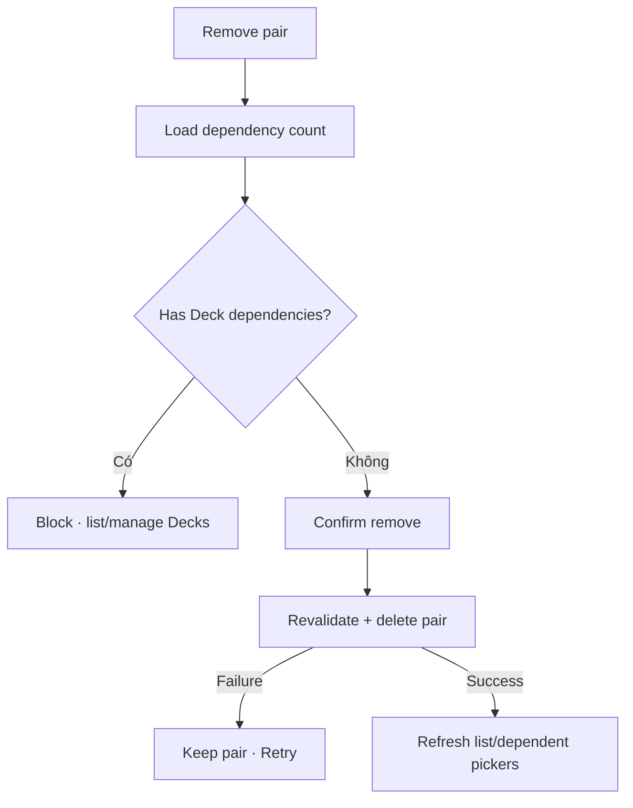

# Đặc tả UI/UX hoàn chỉnh — Remove Language Pair

Flow này xóa Pair chỉ khi không tạo orphan Deck và user đã hiểu dependency impact.

## 1. Nguyên tắc đã chốt

- Pair có Deck dependency không được xóa trực tiếp.
- Không cascade delete Deck/Card.
- Remove là destructive explicit confirmation.
- Last Pair có thể xóa nếu không dependency; app trở về empty setup state.
- Retry/double-confirm xóa tối đa một lần.

## 2. Master flow

## 3. Objective và composition

- Objective: remove Pair an toàn mà không mất học liệu.
- Archetype: Destructive confirmation.
- Confirm copy nêu language names; blocked state nêu dependency count.

## 4. Lifecycle

- Dependency tăng trước confirm làm delete bị chặn.
- Cancel/no-op giữ Pair.
- Success invalidates picker/search display projections.
- Unknown delete outcome resolve Pair id trước Retry.

## 5. State matrix

- No dependency, one/many dependencies, last Pair.
- Confirm/cancel/deleting/failure/success, stale dependency.
- Long names/counts, large font, narrow, light/dark.

## 6. Acceptance criteria

- Không có orphan Deck hoặc cascade delete.
- Dependency được revalidate tại commit.
- Delete idempotent.
- Blocked state cung cấp đường xử lý dependencies.
