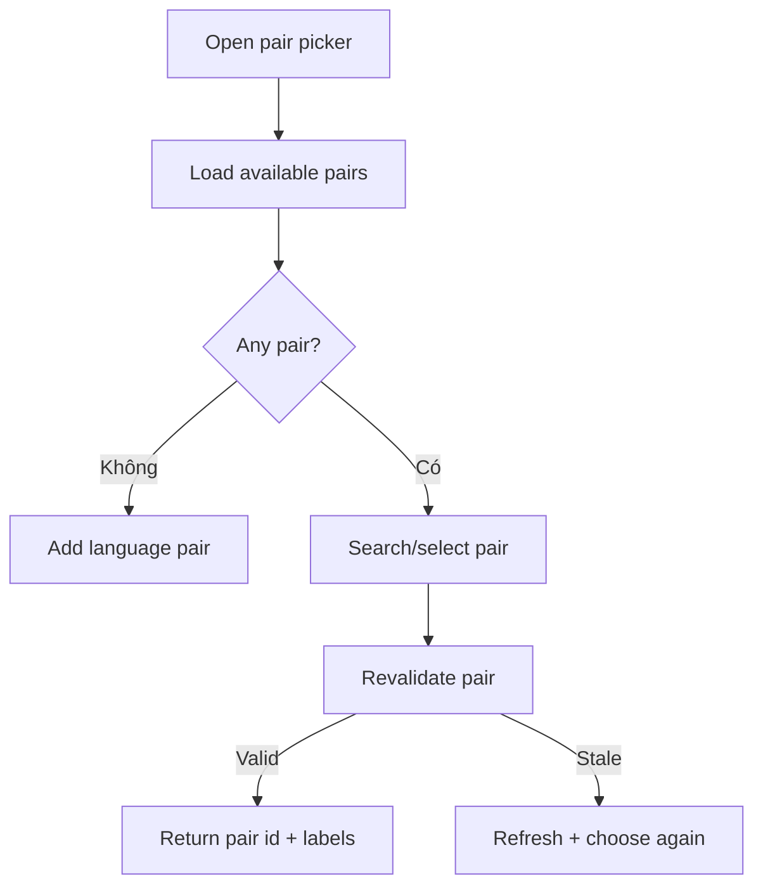

# Đặc tả UI/UX hoàn chỉnh — Select Language Pair

Flow này chọn Pair hợp lệ cho Create Deck hoặc context cho phép đổi Pair.

## 1. Nguyên tắc đã chốt

- Nested Deck kế thừa Pair và không mở picker thay đổi.
- Root Create Deck chọn từ existing pairs hoặc Add Pair.
- Selection dựa stable Pair id, không dựa display label.
- Pair bị xóa/đổi trong picker phải revalidate trước handoff.
- Picker không tự tạo Deck.

## 2. Master flow

## 3. Objective và composition

- Objective: chọn đúng learning/meaning context cho owning flow.
- Archetype: Single-selection list.
- Row hiển thị cả hai languages; selected state có checkmark/semantics.
- `Add language pair` là supporting action.

## 4. Lifecycle

- Dismiss giữ prior selection.
- Add Pair success auto-select chỉ khi owning context còn hợp lệ.
- Search blank/list empty/error phân biệt.
- Handoff không persist Deck cho đến owning flow Save.

## 5. State matrix

- Empty/one/many, selected, search/no-result.
- Add-return, deleted/stale pair, loading/error.
- Long names, large font, narrow, light/dark.

## 6. Acceptance criteria

- Nested Deck không chọn Pair khác parent.
- Selection trả stable id và current labels.
- Stale Pair không được handoff.
- Cancel không thay đổi owning draft ngoài prior selection.
