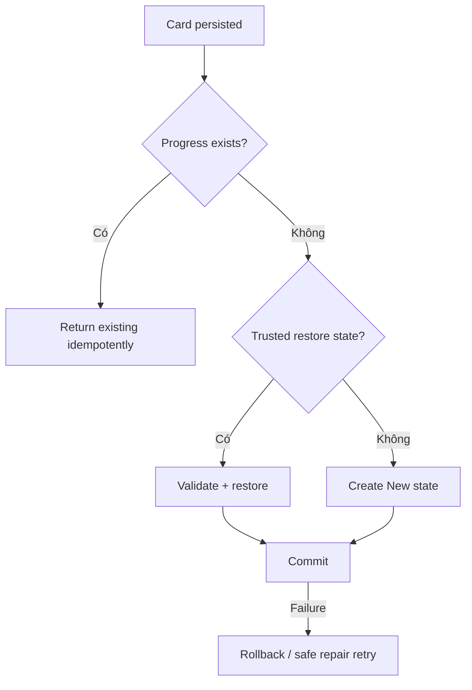

# Đặc tả nghiệp vụ hoàn chỉnh — Initialise Card Progress

Flow này tạo trạng thái học ban đầu cho Card mới/imported. Nó không tự đưa Card vào active Session.

## 1. Nguyên tắc đã chốt

- Mỗi Card có tối đa một current progress state.
- Initialisation idempotent theo Card id.
- Card mới bắt đầu ở stage `new`/chưa học theo policy hiện hành.
- Import progress chỉ được restore khi source/compatibility contract cho phép; không giả lập progress từ card content.
- Hidden Card có progress nhưng không eligible cho Study queue.
- Initialisation failure không làm Card save thành công giả nếu transaction yêu cầu progress record.

## 2. Entry points

| Source | Initial progress |
| --- | --- |
| Create Card | New |
| Import content-only | New |
| Restore compatible backup | Restored validated state |
| Duplicate/Copy Card | New, trừ explicit copy-progress policy |
| Existing Card missing state | Safe repair to New + audit |

# 3. Master flow

# 4. Initial state contract

- Required: Card id, state/stage, created/updated time và policy version cần thiết.
- Due eligibility của New Card do `surface-due-cards.md` quyết định.
- Interval/ease/repetition/lapse values dùng policy defaults, không hard-code tại UI/docs flow khác.
- Không tạo Attempt khi initialise.

# 5. Validation và recovery

- Missing Card → không create orphan progress.
- Duplicate initialise → return same state, không reset learned Card.
- Invalid restored state → chặn restore hoặc fallback chỉ sau explicit recovery decision.
- Failure copy ở owning Create/Import flow phải nói Card/progress có được rollback hay chưa.

# 6. State matrix

- New create; content import; compatible restore; invalid restore.
- Already exists; missing Card; transaction failure; repair.
- Offline/local-first và concurrent initialise.

# 7. Acceptance criteria

- Một Card không có nhiều current progress rows.
- Retry không reset hoặc duplicate existing progress.
- Content-only import tạo New state.
- Restore chỉ dùng validated compatible state.
- No orphan progress và transaction outcome rõ ràng.
