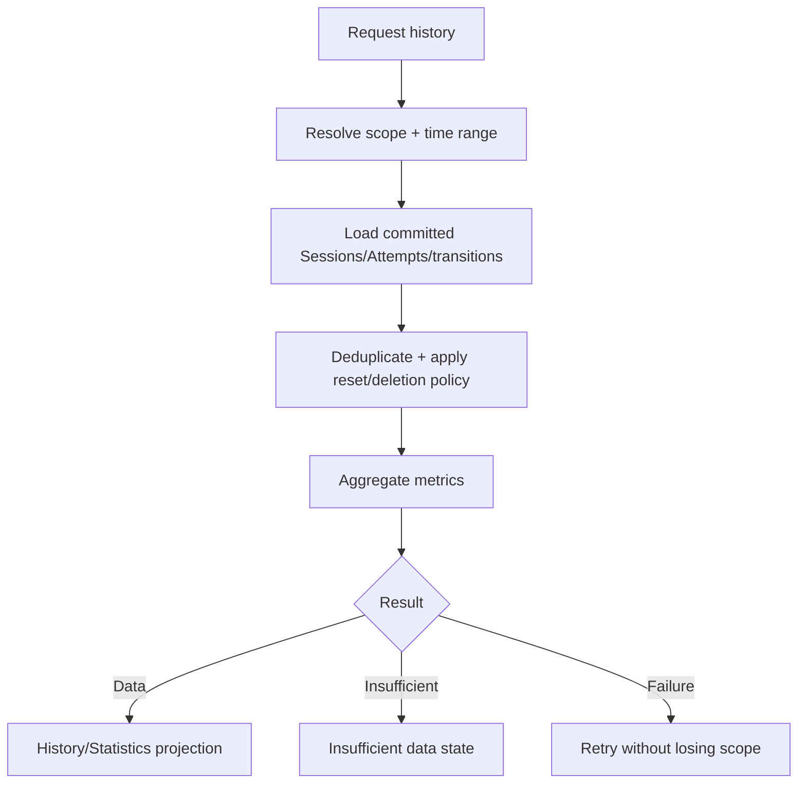

# Đặc tả UI/UX hoàn chỉnh — Inspect Progress History

Flow này sở hữu read-only history contract từ committed Sessions/Attempts/Progress transitions cho Statistics và Card/Deck detail.

## 1. Nguyên tắc đã chốt

- History chỉ dùng committed records; không tính transient UI events.
- Read history không mutate scheduling state.
- Cùng Attempt/session không double-count.
- Reset Progress không xóa lịch sử cũ; projection có thể đánh dấu reset boundary.
- Deleted content tuân retention/privacy policy; không hiển thị broken navigation target.
- Counts/date/percentages dùng locale/timezone nhất quán.

## 2. Entry points

| Consumer | Scope |
| --- | --- |
| Statistics | All/Deck/time range |
| Deck detail | Current Deck/subtree |
| Card detail | Current Card |
| Study Result | Completed Session |

# 3. Master flow

# 4. Projection contract

- Inputs: scope ids, inclusive/exclusive time boundaries, timezone/locale.
- Outputs may include reviewed count, accuracy, retention, streak/heatmap series và session summaries.
- Metric formula/version phải traceable; UI không tự tính từ displayed rows.
- Parent Deck aggregates descendant Cards without double-count.
- Reset boundary không làm pre-reset Attempts biến mất khỏi history.

# 5. Objective, archetype và composition

- Objective: hiểu xu hướng học từ dữ liệu đã commit.
- Archetype: Dashboard/read-only detail.
- Không có competing primary CTA.

Composition: app bar/scope → summary metrics → time-series/heatmap → supporting history → empty/error feedback.

# 6. Load/error lifecycle

- Loading: skeleton đúng chart/list footprint.
- Insufficient: `Study a few cards to see your progress here.`
- Failure: `Couldn’t load your progress. Try again.`; giữ scope/range.
- Stale offline projection phải gắn stale context, không giả current.
- Scope switch cancel pending request cũ hoặc bỏ stale response.

# 7. Data boundaries

- Completed/finalized Session mới đóng góp completion metrics.
- Attempts đã commit trong paused session có thể xuất hiện ở activity history nhưng không giả completed Session.
- Finalize retry contribution idempotent.
- Day bucketing dùng Goal/local-day contract khi hiển thị streak/day series.

# 8. State matrix

- Loaded; scope switch; insufficient; empty; loading; error; offline stale.
- Card/Leaf/Parent/global scopes; reset boundary; deleted content.
- Long labels, large numbers, large font, narrow device, light/dark.

# 9. Acceptance criteria

- Projection read-only và chỉ từ committed data.
- Attempt/session không double-count; Parent aggregate đúng.
- Reset boundary giữ historical trace.
- Timezone/range/metric version deterministic.
- Scope switch không render stale response.
- Canonical Statistics states đạt parity dưới 3% mỗi theme.
