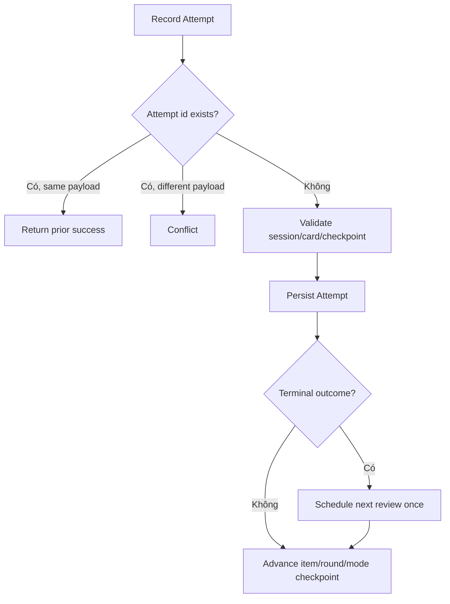

# Đặc tả nghiệp vụ hoàn chỉnh — Record Study Attempt

Flow này nhận Attempt evidence từ Study Session và ghi history idempotently. Scheduling terminal outcome được giao cho `schedule-next-review.md`.

## 1. Nguyên tắc đã chốt

- Attempt identity unique theo submit request; cùng identity apply tối đa một lần.
- Attempt gắn session, Card, stage, evidence/outcome và answered time.
- Chỉ current checkpoint/session writer được ghi.
- Stage evidence không đồng nghĩa một SRS schedule update.
- Terminal Card outcome mới kích hoạt scheduling đúng một lần.
- Attempt trong mastery retry round là non-terminal; `wrong`/`almost` không được schedule SRS chỉ vì Card được đưa vào round kế. Recall UI Forgot đã được map thành canonical `wrong` trước handoff.
- Attempt history immutable; correction dùng explicit superseding/audit contract.

## 2. Input contract

| Field | Rule |
| --- | --- |
| Attempt id | Required idempotency key |
| Session/Card id | Phải thuộc snapshot |
| Stage | Phải là current expected stage |
| Round | `roundIndex` + current-round identity; Review không áp dụng mastery round |
| Evidence | Canonical value của stage |
| Mastery classification | Passing/non-passing theo Study Mode contract |
| Answered time | Clock value, không lấy từ render time |
| Terminal flag/outcome | Chỉ set khi Card round hoàn tất |

# 3. Master flow

# 4. Evidence normalization

- Review: reviewed/completed evidence.
- Match: correct/wrong/almost events summarized per stage contract.
- Guess/Fill: correct/wrong, hint metadata khi có.
- Recall: canonical `correct` từ UI Remembered; canonical `wrong` từ UI Forgot hoặc timeout. Timeout có thể giữ reason/threshold/version/elapsed metadata để audit.
- Mỗi graded Attempt giữ mode, round index và passing/non-passing classification; nhiều round không overwrite history trước.
- Không dùng UI color/animation làm evidence.

# 5. Atomicity và lifecycle

- Attempt + terminal scheduling + next checkpoint nằm trong một consistency boundary.
- Save failure trả recoverable error; Study UI giữ answer.
- Duplicate retry same payload trả success cũ.
- Same id/different payload trả conflict, không overwrite.
- Stale checkpoint không ghi Attempt.

# 6. Error contract

| Case | Error meaning |
| --- | --- |
| Missing session/Card | Not found; không persist |
| Stale stage | Conflict; reload checkpoint |
| Duplicate same | Idempotent success |
| Duplicate different | Conflict/audit |
| Storage failure | Retry-safe failure |

# 7. State matrix

- Stage 1–5 evidence; mastery round 1..N; terminal/non-terminal.
- First write; duplicate retry; payload conflict; stale checkpoint.
- Storage failure/retry; offline; concurrent writer.

# 8. Acceptance criteria

- Một submit identity tạo tối đa một Attempt.
- Stage evidence canonical và thuộc snapshot/checkpoint.
- Non-terminal Attempt không schedule SRS.
- Các Attempt của cùng Card qua nhiều mastery round có identity riêng và không bị gộp hoặc schedule như nhiều terminal outcomes.
- Timeout Recall dùng stable timer-resolution identity; Retry/resume tạo tối đa một canonical `wrong` cho Card attempt.
- DB không persist Recall outcome `remembered`/`forgot`; persisted outcome enum vẫn chỉ là `correct`/`wrong`.
- Terminal outcome schedule một lần trong consistency boundary.
- Failure/retry không duplicate history hoặc advance sai checkpoint.
