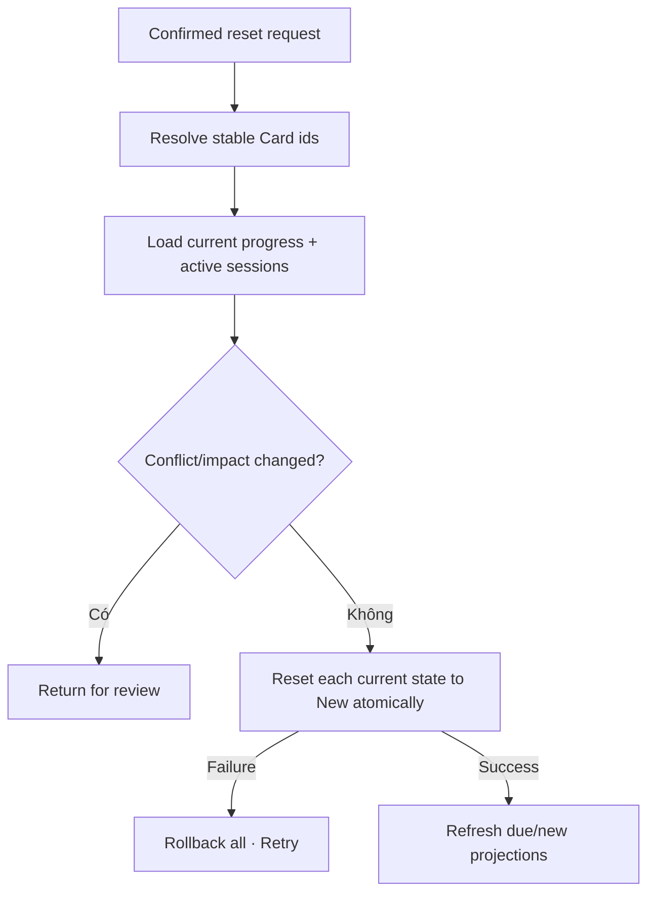

# Đặc tả nghiệp vụ hoàn chỉnh — Reset Learning Progress

Flow này sở hữu transaction đưa Progress của confirmed Card scope về trạng thái New. Deck sở hữu impact UI tại `deck/reset-deck-progress.md`.

## 1. Nguyên tắc đã chốt

- Reset không xóa Card, Deck, translations, audio hoặc hierarchy.
- Scope được resolve thành stable Card ids trước transaction.
- Reset current scheduling state atomic cho toàn scope.
- Attempt/session history không bị xóa bởi flow này; nếu product muốn xóa history phải là destructive flow khác.
- Active session chứa Card trong scope phải được đóng/paused và xử lý rõ trước Reset.
- Retry idempotent; Card đã New không bị tạo duplicate progress.

## 2. Input/output contract

| Contract | Nội dung |
| --- | --- |
| Input | Reset request id, Deck/Card scope, confirmed impact version |
| Validate | Cards còn tồn tại; scope chưa đổi; không active writer conflict |
| Output | Affected count, unchanged count, completion time |

# 3. Master flow

# 4. Reset semantics

- Stage/state trở New theo initialisation policy.
- Due/interval/ease/repetition/lapse scheduling fields trở policy defaults.
- Existing Attempt/history records giữ nguyên và vẫn read-only traceable.
- Goal/streak/completed session summaries không bị sửa ngược.
- Hidden Card vẫn được reset nếu nằm trong confirmed scope; sau reset vẫn hidden.

# 5. Decision table

| Condition | Result |
| --- | --- |
| No affected progress | Idempotent no-op; `Nothing to reset` |
| Scope changed after confirm | Chặn; yêu cầu review impact lại |
| Active session intersects | Chặn/resolve session trước reset |
| Card deleted before commit | Refresh scope; không tạo orphan |
| Same reset request retried | Return prior result |
| Storage error | Rollback toàn scope |

# 6. Lifecycle và recovery

- Resetting giữ request identity, không cho concurrent reset cùng scope.
- Unknown commit outcome: query request id trước retry.
- Failure copy từ Deck flow phải đúng `Nothing has changed` chỉ khi rollback verified.
- Success phát projection invalidation cho due/new counts.

# 7. State matrix

- Empty/no-op; single/many/deep Deck scope.
- Active-session conflict; impact changed; concurrent reset.
- Resetting/failure/rollback/success; offline/local-first.

# 8. Acceptance criteria

- Reset chỉ đổi current scheduling state, không xóa content/history.
- Scope atomic; không partial reset.
- Retry/no-op idempotent.
- Active session không bị silently invalidated.
- Success refresh due/new projections và không rewrite historical Goal/Stats.
