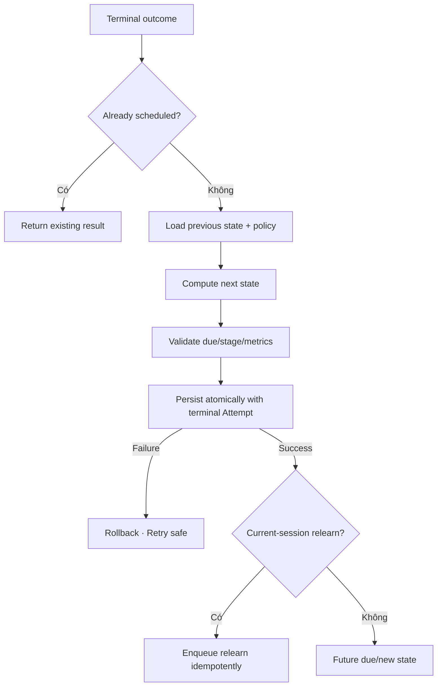

# Đặc tả nghiệp vụ hoàn chỉnh — Schedule Next Review

Flow này chuyển terminal Card outcome thành next Learning Progress state theo effective SRS policy. Nó không sở hữu Study mode UI.

## 1. Nguyên tắc đã chốt

- Schedule apply tối đa một lần cho terminal Attempt/outcome id.
- Input dùng previous progress + terminal outcome + effective policy version.
- Output gồm stage, due time và scheduling metrics cần thiết.
- Relearn có thể due trong current session hoặc tương lai theo policy; UI không hard-code interval.
- Scheduling không sửa Card content/Deck hierarchy.
- Clock/timezone rules phải deterministic và testable.

## 2. Outcome contract

| Outcome class | Expected direction |
| --- | --- |
| `correct` | Advance/maintain learned path theo policy |
| Partial/hard/almost | Conservative next schedule theo policy |
| `wrong` | Lapse/relearn path theo policy |
| Reviewed-only non-terminal | Không schedule |
| Intermediate mastery-round evidence | Không schedule; chờ terminal Card outcome từ Study Session |

Con số interval/ease cụ thể thuộc versioned SRS policy, không nằm trong screen/business flow khác.

# 3. Master flow

# 4. Validation invariants

- Due time hợp lệ theo policy/clock; không NaN/invalid date.
- Repetitions/lapses không âm.
- Stage transition nằm trong policy state machine.
- Policy version được lưu/trace để reproduce decision.
- Deleted/missing Card không tạo new progress.

# 5. Idempotency và concurrency

- Same terminal outcome id trả same scheduled result.
- Different concurrent terminal outcome cho same Card phải serialize/conflict; không last-write-wins im lặng.
- Retry sau unknown commit kiểm tra outcome id trước compute lại.
- Relearn queue item dùng stable identity để không duplicate.

# 6. Error/recovery contract

- Compute/validation error: không persist Attempt terminal completion giả.
- Storage error: rollback Attempt/schedule boundary hoặc giữ pending state recoverable rõ ràng.
- Policy unavailable/incompatible: chặn và giữ session recoverable; không fallback ngầm.

# 7. State matrix

- New→learning; successful; partial/hard; failed/lapse/relearn.
- Already applied; concurrent conflict; invalid prior state/policy.
- Clock/day boundary/timezone; offline; storage failure/retry.

# 8. Acceptance criteria

- Terminal outcome schedule đúng một lần; non-terminal không schedule.
- Intermediate `wrong`/`almost` dùng để tạo mastery round không tự tạo due state hoặc Relearn queue. Recall UI Forgot đã được map thành `wrong`.
- Output tuân versioned policy và validation invariants.
- Concurrent outcomes không overwrite im lặng.
- Relearn item không duplicate qua retry/resume.
- Failure không để Attempt/progress lệch nhau.
