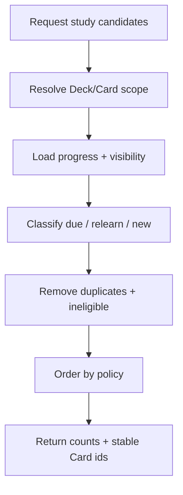

# Đặc tả nghiệp vụ hoàn chỉnh — Surface Due Cards

Flow này tạo eligible queues cho Dashboard và Study entry từ current Progress + Deck scope. Nó là read/selection contract, không mutate progress.

## 1. Nguyên tắc đã chốt

- Queues phân biệt due, relearn và new.
- Hidden/deleted Cards và Cards ngoài Deck scope bị loại.
- Parent scope aggregate descendant Leaves, không direct Parent cards và không double-count.
- Cùng Card không xuất hiện hai lần trong một effective queue response.
- Time comparison dùng effective local clock/timezone contract.
- Reading queues không đánh dấu Card là studied hoặc thay due time.

## 2. Entry points

| Consumer | Requested scope |
| --- | --- |
| Dashboard | All eligible Library content |
| Study Deck | Current Leaf/subtree |
| Resume Session | Snapshot queue, không query lại tùy ý |
| Relearn flow | Session-owned pending queue identity |

# 3. Master flow

# 4. Classification contract

| Queue | Meaning |
| --- | --- |
| Relearn | Failed/lapsed item requiring priority recovery |
| Due | Learned item whose due time is reached |
| New | Eligible Card with initial progress not yet introduced |

- Queue priority/order and new-card limit thuộc effective Study policy.
- Zero due không được giả tạo due items; UI nêu đúng no-due state.

# 5. Scope và eligibility

- Empty Deck → zero candidates.
- Leaf → direct Cards.
- Parent → descendant Leaf Cards.
- Hidden Card excluded; missing progress được safe-repair/flag theo initialise contract.
- Active session snapshot Cards không bị reorder bởi fresh Dashboard query.

# 6. Load/error lifecycle

- Loading consumer giữ composition phù hợp.
- Success trả total + per-queue counts + stable ids.
- Failure: `Couldn’t load your study cards. Try again.`; không hiển thị count cũ như current nếu không gắn stale/offline label.
- Cached offline result phải nêu snapshot time/staleness khi cần.

# 7. Date/time boundaries

- Due-at-equal-now được xem due.
- Local day rollover recalculate Dashboard/new limits.
- Timezone change không mutate stored history; chỉ re-evaluate effective queue theo policy.
- Clock rollback/forward bất thường phải deterministic, không duplicate queue rows.

# 8. State matrix

- Empty; only new; only due; only relearn; mixed; dense.
- Hidden/deleted/missing-progress; Parent deep aggregate.
- Loading/failure/offline stale; midnight/timezone/DST boundaries.
- Large counts và long Deck paths tại consumer UI.

# 9. Acceptance criteria

- Queues mutually unique và đúng eligibility/scope.
- Parent aggregate không double-count; Empty zero.
- Query read-only, không mutate progress.
- Zero due/no eligible được phân biệt.
- Time/day/timezone boundaries deterministic.
- Consumer canonical due/not-enough/loading states parity dưới 3% mỗi theme.
