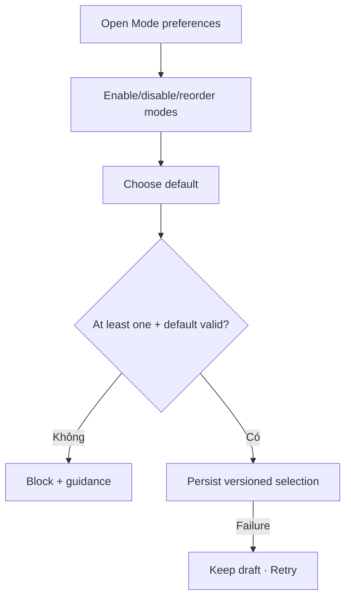

# Đặc tả UI/UX hoàn chỉnh — Configure Mode Preferences

Flow này chọn mode availability/default order trong giới hạn eligibility của Study Mode.

## 1. Nguyên tắc đã chốt

- Không thể vô hiệu hóa mọi mode nếu session cần ít nhất một mode.
- Default mode phải nằm trong enabled set và vẫn qua eligibility lúc Start.
- Preference không bảo đảm Deck đủ Card cho mode.
- Active Session giữ mode snapshot.
- Unknown mode id bị bỏ qua/fallback an toàn.

## 2. Master flow

## 3. Objective và composition

- Objective: ưu tiên các mode muốn dùng cho session mới.
- Archetype: Reorderable selection Settings.
- Mỗi mode có name, short purpose, enabled state và minimum note.
- Reorder có accessible move controls ngoài drag.

## 4. Lifecycle

- Disable default yêu cầu chọn fallback trước Save.
- New/removed mode qua app upgrade dùng compatibility fallback.
- Study Start revalidates mode/minimum và có alternative guidance.
- Dirty Back giữ/discard draft rõ.

## 5. State matrix

- Defaults/custom order, one/all enabled, disable default.
- Unknown/deprecated/new mode, saving/failure, active Session.
- Large font, reduced motion, narrow, light/dark.

## 6. Acceptance criteria

- Luôn có cấu hình mode hợp lệ.
- Default thuộc enabled set nhưng không bypass eligibility.
- Active Session không đổi giữa chừng.
- Reorder khả dụng không cần drag.
