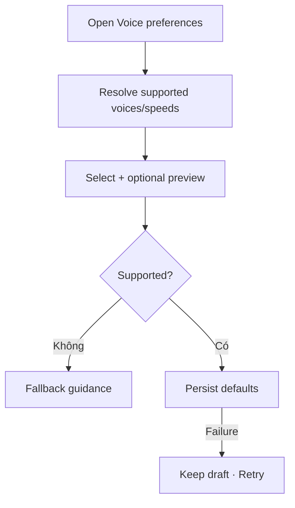

# Đặc tả UI/UX hoàn chỉnh — Configure Voice Preferences

Flow này chọn voice, speed và audio defaults dùng cho generation/playback trong phạm vi hỗ trợ.

## 1. Nguyên tắc đã chốt

- Voice/speed phải thuộc supported options của language/context.
- Preference không rewrite stored audio asset.
- Preview là tạm thời và không tạo Study progress.
- Missing/deprecated voice fallback rõ theo language.
- Active Playback giữ session speed/voice snapshot trừ explicit change.

## 2. Master flow

## 3. Objective và composition

- Objective: chọn audio defaults dễ nghe.
- Archetype: Selection Settings with preview.
- Voice picker hiển thị language/variant; speed picker dùng supported labels.
- Preview control có play/stop và accessible status.

## 4. Lifecycle

- Preview loading/error không chặn Save option hợp lệ.
- Đổi language context refresh supported voices.
- Save failure không đổi persisted default; preview có thể dừng an toàn.
- Player session mới đọc preference; asset management vẫn thuộc Flashcard.

## 5. State matrix

- Default/custom, preview loading/playing/error.
- Missing/deprecated voice, unsupported speed, offline provider.
- Long labels, large font, narrow, light/dark.

## 6. Acceptance criteria

- Chỉ option supported được persist.
- Preview không mutate Card/Progress.
- Deprecated value fallback không crash.
- Preference không thay đổi audio asset hiện có.
