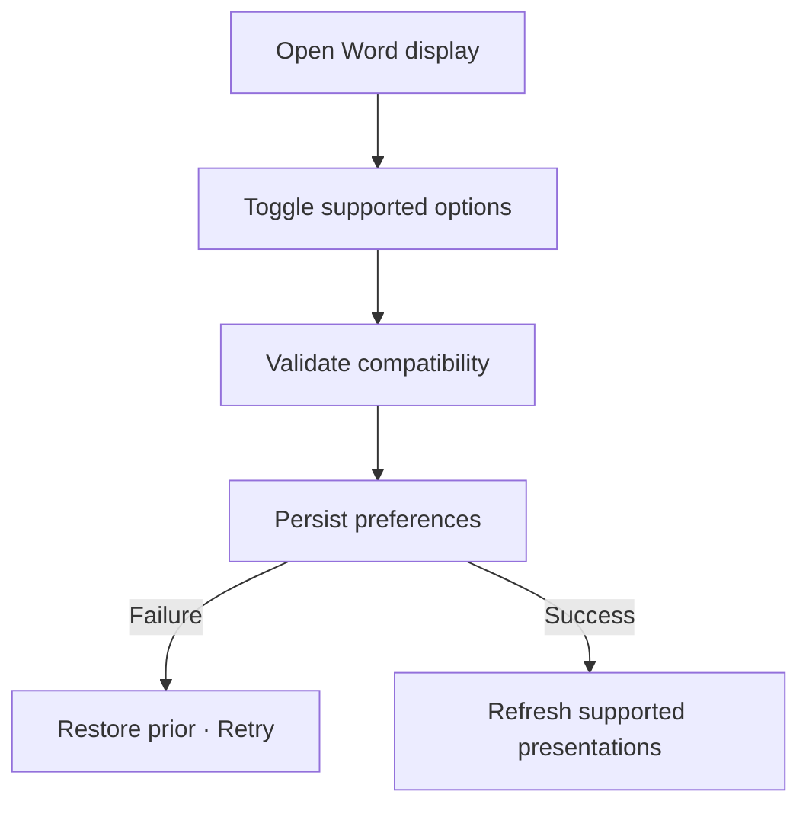

# Đặc tả UI/UX hoàn chỉnh — Configure Word Display

Flow này chọn cách hiển thị meaning, gender, romanization và supported word metadata mà không sửa Flashcard content.

## 1. Nguyên tắc đã chốt

- Options chỉ điều khiển presentation, không xóa/reorder stored Card data.
- Missing metadata không render placeholder gây hiểu nhầm.
- Preference áp dụng nhất quán ở supported surfaces.
- Session snapshot policy quyết định thay đổi có hiệu lực ngay hay session kế.
- Accessibility không phụ thuộc metadata bị ẩn để hiểu prompt chính.

## 2. Master flow

## 3. Objective và composition

- Objective: giảm/tăng thông tin hỗ trợ khi xem Card.
- Archetype: Toggle Settings group.
- Mỗi option có mô tả và preview dùng sample data, không dùng Card thật nhạy cảm.

## 4. Lifecycle

- Toggle có confirmed state hoặc rollback khi persist lỗi.
- Unsupported metadata option được ẩn/disabled với lý do.
- Restore defaults dùng cùng save contract.
- Card editor vẫn hiển thị stored content để quản lý dù study display ẩn.

## 5. State matrix

- All default/on/off/mixed; missing metadata.
- Unsupported option, saving/failure, session active.
- Long multilingual text, large font, narrow, light/dark.

## 6. Acceptance criteria

- Không mutation Card content.
- Presentation nhất quán theo effective preference.
- Missing/hidden metadata không làm prompt mất nghĩa chính.
- Failure không để switch và actual display diverge.
