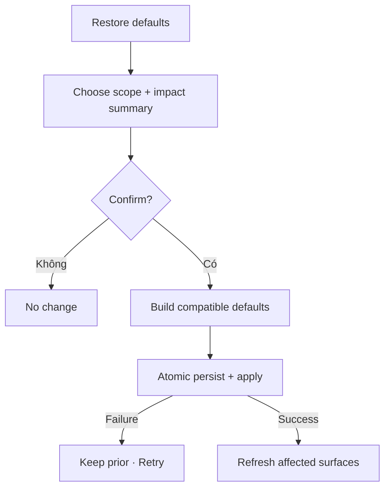

# Đặc tả UI/UX hoàn chỉnh — Restore Default Preferences

Flow này reset một nhóm hoặc toàn bộ Preferences về defaults tương thích sau explicit impact review.

## 1. Nguyên tắc đã chốt

- Scope reset rõ: appearance, study, display, mode, voice hoặc all.
- Confirm nêu nhóm bị ảnh hưởng; không xóa Account/content/history.
- Defaults theo current compatibility version.
- Apply nhiều nhóm atomic; failure giữ prior persisted set.
- Active Session/Playback giữ snapshot hiện hành theo contract.

## 2. Master flow

## 3. Objective và composition

- Objective: quay lại cấu hình mặc định mà không ảnh hưởng dữ liệu học.
- Archetype: Destructive-to-settings confirmation.
- Primary CTA `Restore`; Cancel là safe default.

## 4. Lifecycle

- Confirm/double-submit dùng một reset identity.
- Appearance apply cùng transaction/rollback presentation nhất quán.
- Success summary nêu scope đã reset.
- Unknown outcome resolve preference version trước Retry.

## 5. State matrix

- One group/all, already-default, active Session/Playback.
- Confirm/cancel/restoring/failure/success, compatibility migration.
- Long impact copy, large font, narrow, light/dark.

## 6. Acceptance criteria

- Chỉ selected scope được reset.
- Account/Deck/Card/Progress không bị thay đổi.
- Multi-group reset atomic và idempotent.
- Active snapshots tuân effective-time contract.
