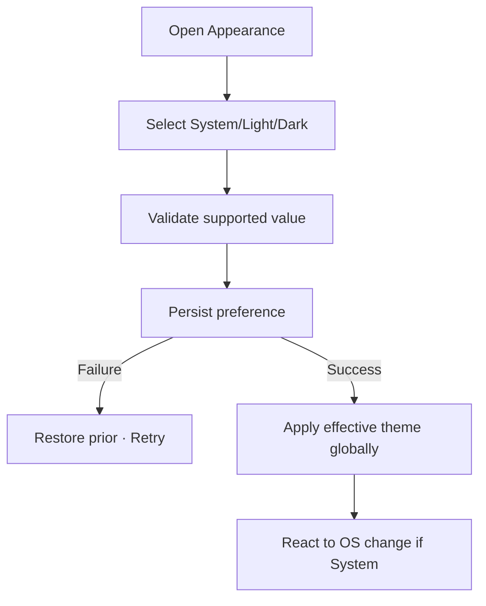

# Đặc tả UI/UX hoàn chỉnh — Set Appearance Preference

Flow này chọn System, Light hoặc Dark trong tập appearance được hỗ trợ toàn ứng dụng.

## 1. Nguyên tắc đã chốt

- Preference chỉ chọn supported theme mode; Design System sở hữu tokens.
- System theo effective OS theme và cập nhật khi OS đổi.
- Invalid persisted value fallback System.
- Apply toàn app, không override cục bộ theo screen.
- Thay đổi không ảnh hưởng content/progress.

## 2. Master flow

## 3. Objective và composition

- Objective: chọn cách app hiển thị màu sắc.
- Archetype: Single-selection Settings.
- Mỗi option có label/checkmark; preview không dùng raw values ngoài Design System.

## 4. Lifecycle

- Apply/persist phải rollback nhất quán khi failure.
- Rapid selection chỉ latest value thắng.
- System event không rewrite selected preference.
- Restore defaults gọi cùng validation/apply path.

## 5. State matrix

- System effective light/dark, explicit light/dark.
- Invalid fallback, saving/failure, rapid switch, OS change.
- Large font, narrow, both themes.

## 6. Acceptance criteria

- Toàn app phản ánh một effective theme.
- System selection được giữ khi OS theme đổi.
- Invalid value không crash.
- Failure không để selected label khác rendered theme.
