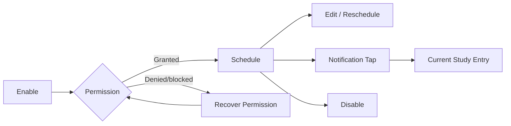

# Reminder business flows

Reminder sở hữu lịch nhắc học local, permission và notification scheduling. Study Goal chỉ cung cấp context; Reminder không thay đổi goal hoặc due state.

## Invariants

- Reminder disabled không có active future notification do object này quản lý.
- Enabled reminder cần valid local time và ít nhất một valid schedule rule.
- Permission denied không được báo enabled thành công giả.
- Reschedule thay thế schedule cũ, không tạo duplicate notifications.
- Timezone/daylight change phải re-evaluate next fire time.
- Notification tap chỉ điều hướng; không tự bắt đầu Study.

## Primary reminder flow

## Flow catalog

| File | Flow sở hữu | Trạng thái |
| --- | --- | --- |
| [enable-study-reminder.md](./enable-study-reminder.md) | Permission, time selection và initial schedule | Đã có |
| [edit-study-reminder.md](./edit-study-reminder.md) | Đổi time/days và atomic reschedule | Đã có |
| [disable-study-reminder.md](./disable-study-reminder.md) | Cancel future notifications và persist disabled | Đã có |
| [recover-reminder-permission.md](./recover-reminder-permission.md) | Denied/blocked/system-settings recovery | Đã có |
| [open-reminder-notification.md](./open-reminder-notification.md) | Notification tap, stale target và destination | Đã có |

## Cross-object contracts

- Có thể đọc Goal/Due summary để tạo contextual copy, không mutate chúng.
- Preferences cung cấp notification/appearance preferences nếu có.
- Notification tap tới Dashboard/Study entry, sau đó Study Session revalidates eligibility.

## Canonical state coverage

- Off/on; time picker; permission prompt/denied/blocked.
- Scheduling/submitting/failure/success; timezone change; notification tap stale.
- Large font, narrow device, long localized time/day labels, light/dark.
