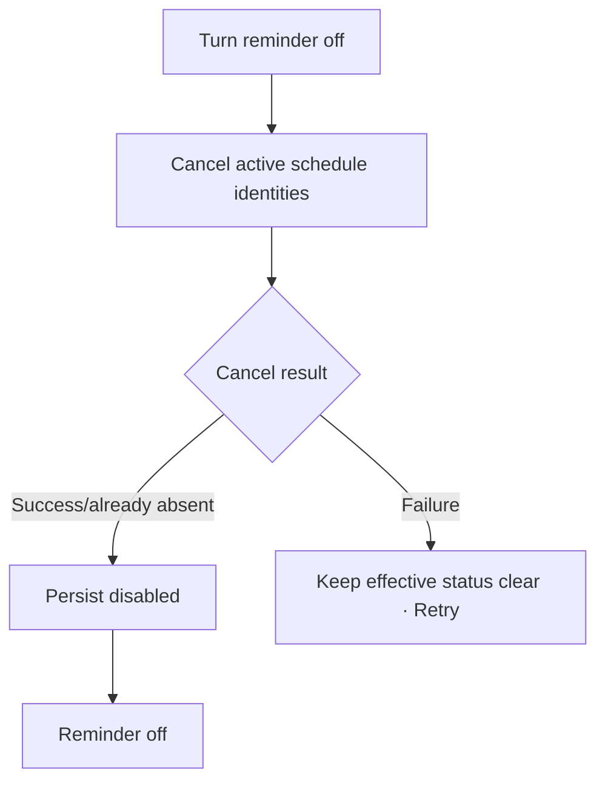

# Đặc tả UI/UX hoàn chỉnh — Disable Study Reminder

Flow này hủy future notifications do Reminder quản lý và persist disabled state.

## 1. Nguyên tắc đã chốt

- Disable là explicit user action.
- Success nghĩa là không còn active future notification identity do Reminder quản lý.
- Last time/days có thể giữ làm draft cho lần bật lại.
- Disable không sửa Goal, due cards hoặc notification history đã delivered.
- Retry idempotent; missing platform schedule vẫn có thể hoàn tất disabled.

## 2. Master flow

## 3. Objective và composition

- Objective: dừng future study reminders.
- Archetype: Settings.
- Với one reminder, switch off áp dụng trực tiếp; không cần destructive dialog.
- Nếu hệ thống không xác nhận cancel, không hiển thị success giả.

## 4. Lifecycle

- Disabling: disable switch/double-toggle; announce progress.
- Failure: `Couldn’t turn off the reminder. Try again.` và hiển thị effective status đáng tin cậy.
- Success: `Reminder off`; next reminder row ẩn/disabled.
- Re-enable dùng saved draft nhưng vẫn revalidate permission/schedule.

## 5. State matrix

- On→disabling→off; already absent; failure/unknown status; offline local.
- Permission revoked while disabling; app background/retry.
- Large font, narrow device, light/dark.

## 6. Acceptance criteria

- Success không còn future schedule do Reminder sở hữu.
- Retry/already absent idempotent.
- Goal/Due/history không đổi.
- Failure không báo off nếu cancel chưa verified.
- On/off canonical states parity dưới 3% mỗi theme.
