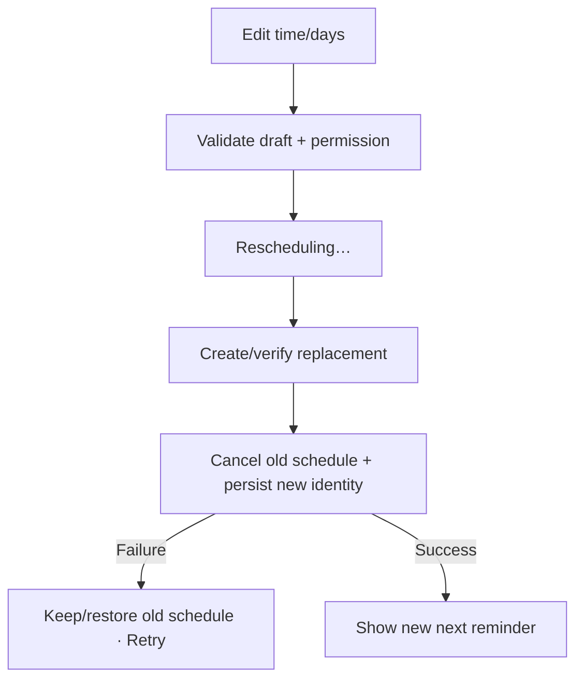

# Đặc tả UI/UX hoàn chỉnh — Edit Study Reminder

Flow này thay đổi time/days của Reminder đang enabled và thay schedule cũ bằng schedule mới atomically.

## 1. Nguyên tắc đã chốt

- Edit không tạo schedule song song.
- Schedule cũ chỉ bị thay khi schedule mới được xác nhận thành công hoặc transaction có rollback rõ.
- Failure giữ effective schedule cũ và draft mới.
- Timezone/daylight change dùng cùng reschedule contract.
- Permission được revalidate trước apply.

## 2. Master flow

## 3. Composition và field rules

- Objective: thay lịch và xác nhận next reminder mới.
- Archetype: Settings/time selection.
- Time localized; days use multi-selection with accessible labels.
- No selected day hoặc invalid time chặn apply.
- Dirty Back hỏi `Discard reminder changes?`.

## 4. Lifecycle

- Clean: no save action/disabled apply.
- Dirty valid: `Save`/apply action primary trong picker.
- Rescheduling: disable controls/double-submit.
- Failure: `Couldn’t update the reminder. Your previous schedule is still active.`
- Success: snackbar `Reminder updated`; next fire time refresh.

## 5. Concurrency/timezone

- Permission revoked → route recovery, không giả previous schedule vẫn deliverable.
- Timezone/DST event re-evaluates next fire; no duplicate schedule.
- Concurrent edit uses current schedule version; stale apply conflicts.

## 6. State matrix

- Time change; days change; invalid; dirty discard.
- Rescheduling/failure/success; permission revoked; timezone/DST.
- Large font, narrow device, long day labels, light/dark.

## 7. Acceptance criteria

- Tối đa một effective schedule identity.
- Failure giữ/restores old schedule và draft.
- Stale/concurrent edit không overwrite im lặng.
- Next reminder phản ánh timezone-aware schedule mới.
- Time-picker canonical state parity dưới 3% mỗi theme.
