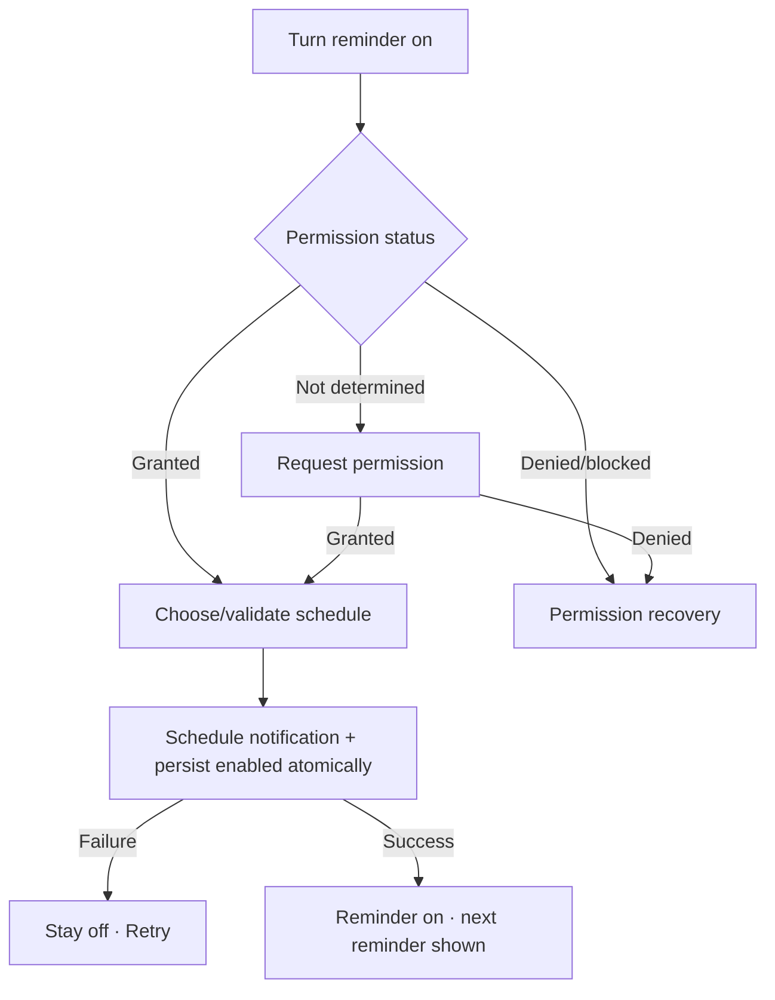

# Đặc tả UI/UX hoàn chỉnh — Enable Study Reminder

Flow này xin permission khi cần, validate schedule và tạo notification đầu tiên. Nó không tự bật từ Goal configuration.

## 1. Nguyên tắc đã chốt

- User chủ động bật Reminder.
- Enabled chỉ được persist sau permission phù hợp và schedule thành công.
- Permission prompt chỉ hiện đúng lúc user bật, không hiện khi mở Settings.
- Valid local time và ít nhất một selected day/rule là bắt buộc.
- Retry không tạo duplicate notifications.
- Goal/Due context chỉ ảnh hưởng copy, không ảnh hưởng enable state.

## 2. Master flow



## 3. Objective, archetype và composition

- Objective: bật một lịch nhắc hợp lệ và biết lần nhắc tiếp theo.
- Archetype: Settings.
- Switch là direct setting action; time/day picker là supporting controls.

```text
Study reminder                                  [ on ]
Time                                             19:00
Days                                             Every day
Next reminder                                    Tomorrow · 19:00
```

## 4. Lifecycle và validation

- Missing time/days: giữ off, inline `Choose when you want to be reminded.`
- Scheduling: disable switch/controls; announce `Scheduling…`.
- Failure: `Couldn’t schedule the reminder. It’s still off. Try again.`
- Success: persist enabled + platform schedule identity; display next fire time.
- App background trong scheduling phải resolve request id trước Retry.

## 5. State matrix

- Off; permission not-determined/granted/denied/blocked.
- Time/day picker; invalid; scheduling/failure/on.
- Timezone boundary, long localized days/time, large font, narrow, light/dark.

## 6. Acceptance criteria

- Permission không được xin khi chỉ mở screen.
- Enabled chỉ khi platform schedule thành công.
- Retry/double-toggle không duplicate notifications.
- Failure giữ off và draft schedule.
- Canonical on/off/time-picker/permission states parity dưới 3% mỗi theme.
