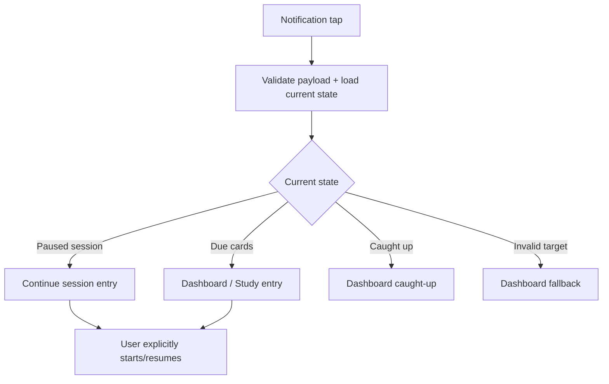

# Đặc tả UI/UX hoàn chỉnh — Open Reminder Notification

Flow này xử lý tap notification và điều hướng tới current learning entry. Nó không tự tạo/bắt đầu Session.

## 1. Nguyên tắc đã chốt

- Notification payload chứa stable intent/identity, không chứa trusted current due count.
- Tap luôn re-read current Goal/Due/Session state.
- Active paused Session ưu tiên `Continue session` context.
- Không eligible cards → Dashboard caught-up/empty state, không error.
- Stale/deleted Deck target fallback Dashboard/Library an toàn.
- Repeated tap không push duplicate routes hoặc create Session.

## 2. Master flow

## 3. Objective và navigation

- Objective: đưa user tới learning context hiện tại với một hành động rõ.
- Cold start đợi app/data ready trước navigation.
- Foreground tap không reset current unsaved flow; resolve theo navigation policy.
- Back từ destination tuân normal app navigation, không quay splash/dead route.

## 4. Payload/staleness rules

- Payload version/intent unknown → safe Dashboard fallback.
- Due count/copy trong delivered notification chỉ là snapshot; UI hiển thị current count.
- Target Deck moved → resolve by id; deleted → fallback.
- Reminder disabled sau delivery không làm tap crash; notification history vẫn có thể mở.

## 5. Lifecycle và error copy

- Loading: app shell/splash contract, không render stale target.
- Recoverable load failure: Dashboard error + Retry.
- No due: `You’re all caught up.`; không tự add new cards.
- Resume failure dùng `resume-study-session.md`.

## 6. State matrix

- Cold/warm/foreground tap; paused Session; due cards; caught-up.
- Invalid/old payload; moved/deleted Deck; load failure.
- Repeated tap; permission/reminder disabled after delivery.

## 7. Acceptance criteria

- Tap không tự start/resume Session; user action vẫn explicit.
- Current state được revalidated, không tin stale count.
- Invalid target/payload fallback an toàn.
- Repeated tap không duplicate route/session.
- Destination Goal/Dashboard/Resume canonical states parity dưới 3% mỗi theme.
