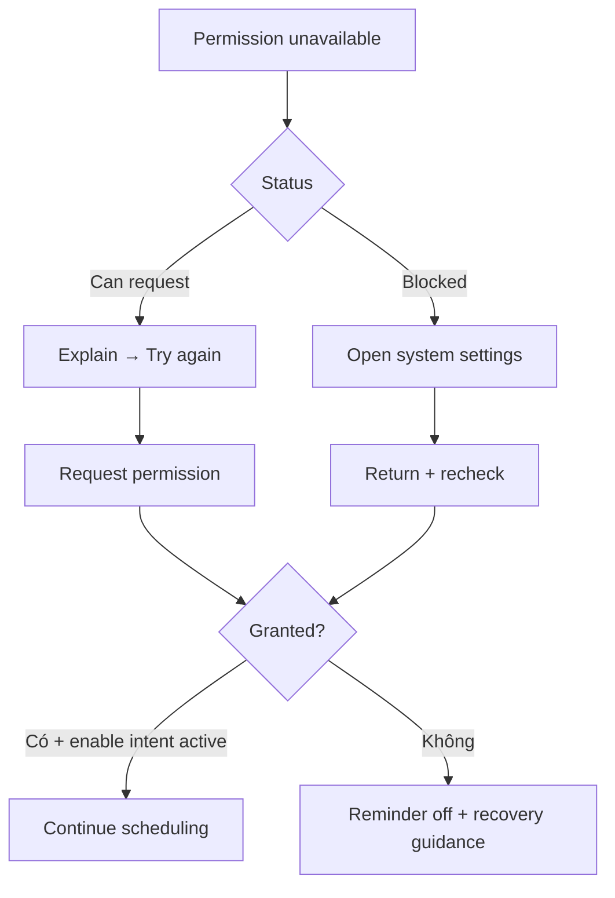

# Đặc tả UI/UX hoàn chỉnh — Recover Reminder Permission

Flow này xử lý denied/blocked/revoked notification permission và quay lại scheduling an toàn.

## 1. Nguyên tắc đã chốt

- Phân biệt denied có thể request lại và blocked cần mở system settings.
- Không lặp permission prompt sau mỗi app launch.
- App quay từ system settings phải re-read permission, không giả granted.
- Granted không tự bật Reminder nếu user đã hủy intent.
- Permission revoked làm enabled state/schedule health hiển thị rõ.

## 2. Master flow



## 3. Composition

```text
Allow notifications to get study reminders.
You can change this in system settings.

[ Open settings ]
  Not now
```

- Objective: khôi phục permission hoặc giữ Reminder off có giải thích.
- Archetype: Settings/empty recovery.
- `Not now` luôn khả dụng; permission không chặn Study.

## 4. Lifecycle và errors

- Request/open settings failure có Retry, không loop.
- Return granted + active enable intent → resume enable flow.
- Return granted + no intent → giữ off, cho user bật thủ công.
- Return denied → expanded helper, không auto-prompt lại.

## 5. State matrix

- Denied; denied expansion; requestable; blocked; opening settings.
- Return granted/denied; permission revoked while on; platform error.
- Long localized helper, large font, narrow device, light/dark.

## 6. Acceptance criteria

- Denied/blocked có recovery đúng platform status.
- Không prompt loop hoặc báo enabled giả.
- Permission granted không bypass user intent.
- Study vẫn hoạt động khi permission unavailable.
- Canonical permission-denied states parity dưới 3% mỗi theme.
