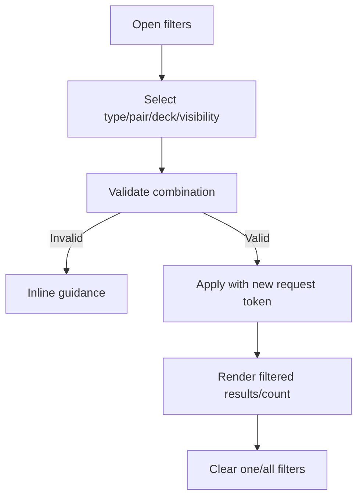

# Đặc tả UI/UX hoàn chỉnh — Filter Search Results

Flow này lọc result theo object type, language pair, Deck scope và visibility trong phạm vi policy Search hỗ trợ.

## 1. Nguyên tắc đã chốt

- Filter chỉ thu hẹp result set, không thay đổi source object.
- Invalid/deleted filter value bị loại có thông báo, không làm screen crash.
- Active filters luôn nhìn thấy và có `Clear` rõ.
- Target-picker filter không tự cấp eligibility; owning Move/Add flow revalidate.
- Query và filters tạo một request identity thống nhất.

## 2. Master flow

## 3. Objective và composition

- Objective: giảm result đến phạm vi mong muốn.
- Archetype: Filter sheet + result list.
- Chips tóm tắt active filters; picker Deck hiển thị path.
- `Show results` là primary CTA trong modal; Clear là secondary.

## 4. Lifecycle

- Draft filter chỉ apply khi confirm nếu dùng modal.
- Rapid apply bỏ stale responses.
- No-results-with-filters nêu Clear/adjust filters.
- Back/dismiss giữ applied filters, bỏ draft chưa apply.

## 5. State matrix

- None/one/multiple filters; invalid/deleted value.
- Results/no-results, applying/error, long Deck path.
- Large font, keyboard, narrow, light/dark.

## 6. Acceptance criteria

- Active filters và result count nhất quán.
- Clear phục hồi query không filter.
- Filter không bypass target eligibility.
- Stale response không ghi đè filter mới.
