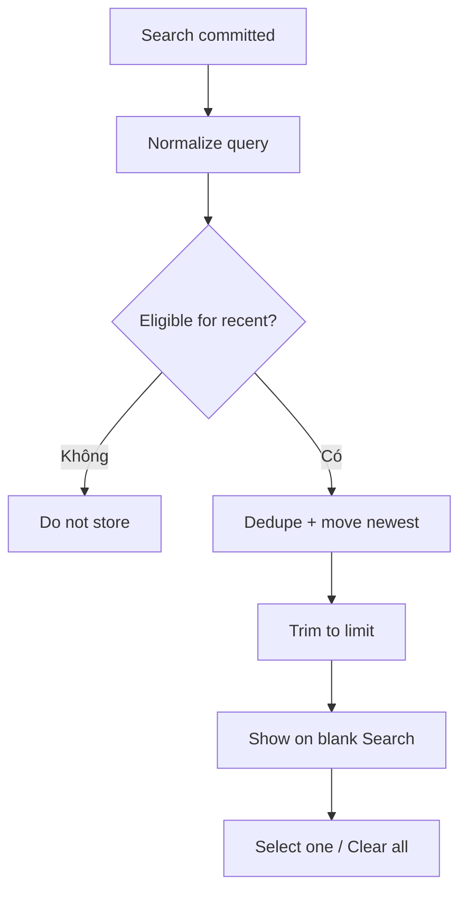

# Đặc tả UI/UX hoàn chỉnh — Manage Recent Searches

Flow này ghi, dedupe, hiển thị và xóa recent queries theo privacy policy.

## 1. Nguyên tắc đã chốt

- Chỉ committed non-blank query theo policy mới vào recent.
- Query normalized dùng để dedupe; display giữ text hữu ích gần nhất.
- Danh sách có giới hạn và thứ tự newest-first.
- Clear là explicit; sync/backup chỉ khi compatibility/privacy contract cho phép.
- Không lưu result content hoặc private payload ngoài query policy.

## 2. Master flow

## 3. Objective và composition

- Objective: chạy lại query gần đây hoặc xóa history.
- Archetype: Lightweight history list.
- Row có query và remove action; `Clear all` cần confirm khi destructive policy yêu cầu.

## 4. Lifecycle

- Select recent điền query và chạy search mới.
- Remove/Clear update local list idempotently.
- Failure không giả xóa; cho Retry hoặc giữ list.
- Signed-out/offline không ảnh hưởng local recent policy.

## 5. State matrix

- Empty/one/full list, duplicate query, remove one, clear confirm.
- Storage failure, compatibility fallback, long multilingual query.

## 6. Acceptance criteria

- Blank/invalid query không được lưu.
- Duplicate tạo một entry ở vị trí mới nhất.
- Clear không xóa Deck/Card hoặc Search index.
- Recent data tuân giới hạn và privacy policy.
