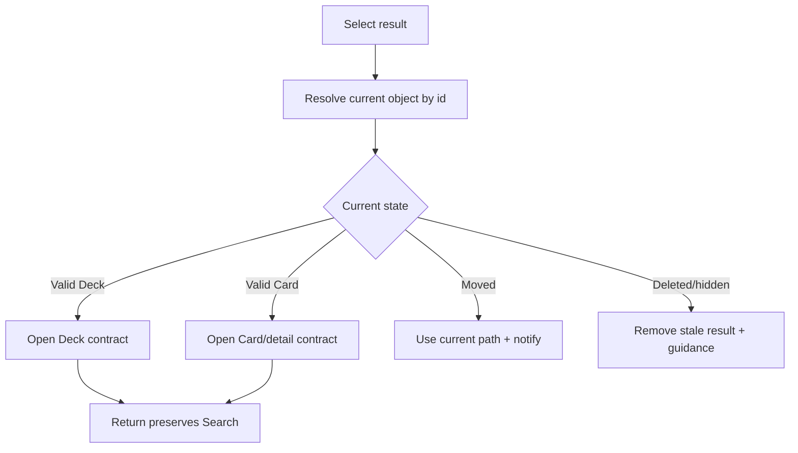

# Đặc tả UI/UX hoàn chỉnh — Open Search Result

Flow này resolve result theo trạng thái object hiện hành và handoff tới Deck/Card contract phù hợp.

## 1. Nguyên tắc đã chốt

- Stable id là nguồn resolve; display text/path chỉ hỗ trợ nhận biết.
- Object được revalidate ngay trước navigation.
- Deleted/hidden/moved object không mở route stale.
- Return giữ query, filters và scroll position khi còn hợp lệ.
- Search không tự edit hoặc đổi eligibility của target.

## 2. Master flow

## 3. Objective và navigation

- Objective: mở đúng object hiện hành từ kết quả.
- Archetype: Result handoff.
- Loading ngắn dùng selected-row progress; không khóa toàn screen khi không cần.
- Destination và Back behavior theo owning object.

## 4. Lifecycle

- Double tap chỉ tạo một navigation.
- Resolve failure giữ Search context và Retry.
- Sau edit/delete, return refresh affected result/index.
- Deep result trong Parent mở đúng hierarchy context.

## 5. State matrix

- Valid Deck Empty/Leaf/Parent; valid Card.
- Moved, renamed, hidden, deleted, resolve failure.
- Duplicate names/path, rapid selection, return after mutation.

## 6. Acceptance criteria

- Không mở object chỉ dựa vào text/path cũ.
- Stale result không dẫn tới route hỏng.
- Return giữ query/filter/position.
- Owning flow vẫn quyết định actions/eligibility.
