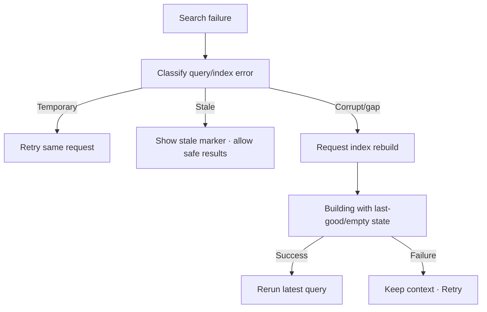

# Đặc tả UI/UX hoàn chỉnh — Recover Search Failure

Flow này xử lý query failure, stale/corrupt index và rebuild handoff mà vẫn giữ Search context.

## 1. Nguyên tắc đã chốt

- Error giữ query, filters và recent context.
- Temporary query failure khác stale/corrupt index.
- Retry cùng query không thêm recent trùng.
- Rebuild không khóa việc đọc last-good index nếu policy cho phép.
- Search result vẫn revalidate khi index stale.

## 2. Master flow

## 3. Objective và presentation

- Objective: phục hồi Search mà không buộc user nhập lại.
- Archetype: Inline recoverable error.
- Primary CTA: Retry hoặc Rebuild tùy classification; copy tránh lỗi kỹ thuật nội bộ.

## 4. Lifecycle

- Rerun chỉ dùng latest query/filter token.
- App background/resume kiểm tra job trước tạo rebuild mới.
- Rebuild success không tự navigate result.
- Last-good results có stale badge và Open revalidation.

## 5. State matrix

- Temporary failure, offline, stale, corrupt, rebuilding.
- Last-good available/unavailable, rebuild failure/success.
- Query changes during rebuild, long copy, light/dark.

## 6. Acceptance criteria

- Recovery giữ query/filter.
- Stale response/job không ghi đè latest state.
- Rebuild idempotent và không mutate Deck/Card.
- UI phân biệt no-results với failure.
