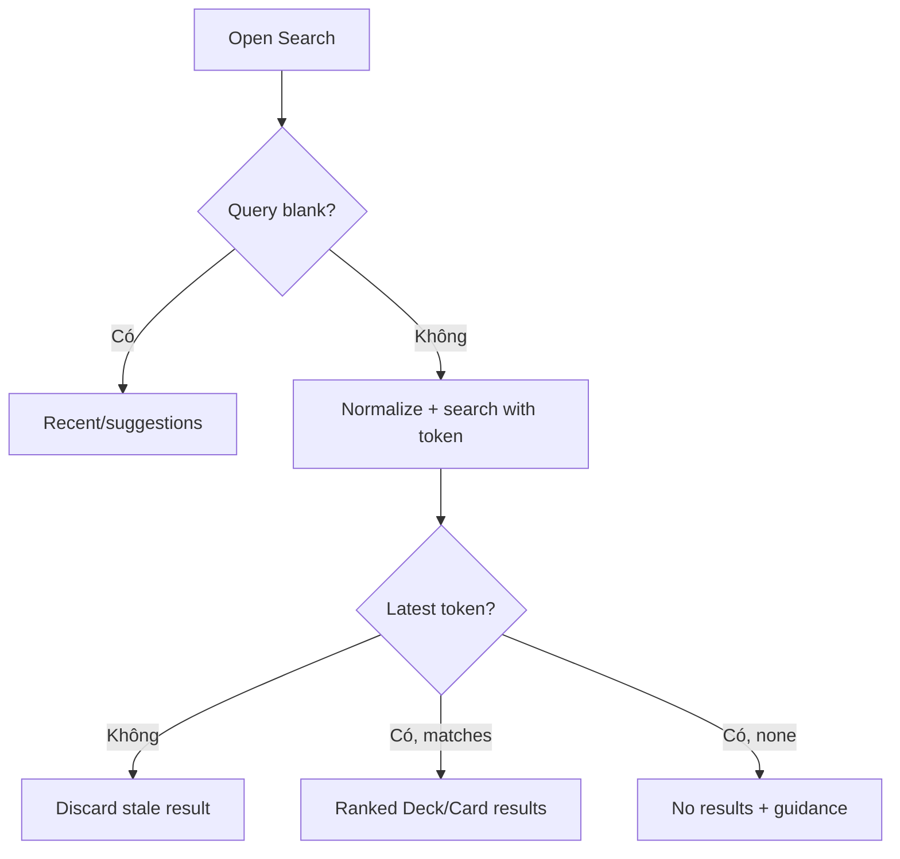

# Đặc tả UI/UX hoàn chỉnh — Search Library Content

Flow này tìm Deck và Flashcard theo query trong Library index mà không thay đổi object nguồn.

## 1. Nguyên tắc đã chốt

- Blank query hiển thị recent/suggestion, không được coi là no-results.
- Query normalization hỗ trợ multilingual text theo policy đã phiên bản hóa.
- Result luôn mang stable id, type và Deck path đủ phân biệt.
- Hidden/deleted content tuân visibility policy tại thời điểm trả kết quả.
- Rapid typing không để response cũ ghi đè query mới.

## 2. Master flow

## 3. Objective và composition

- Objective: tìm và mở đúng nội dung Library.
- Archetype: Search/results.
- Search input là primary interaction; result group theo type khi giúp scan.
- Result Card hiển thị matched field, type và path; không chỉ tên.

## 4. Lifecycle

- Debounce không làm mất IME composition hoặc submit explicit.
- Loading giữ query; error giữ query/filter và Retry.
- Search success có thể ghi recent theo privacy contract.
- Offline dùng local index; stale index gắn recovery state.

## 5. State matrix

- Empty/recent, typing, loading, mixed results, no-results, error.
- Duplicate names, hidden/deleted/stale result, long multilingual query.
- Keyboard, large font, narrow, light/dark.

## 6. Acceptance criteria

- Result tương ứng query mới nhất.
- Deck/Card trùng tên vẫn mở đúng object qua id/path.
- Blank và no-results là hai state khác nhau.
- Search không mutate Deck/Card hoặc bypass visibility policy.
