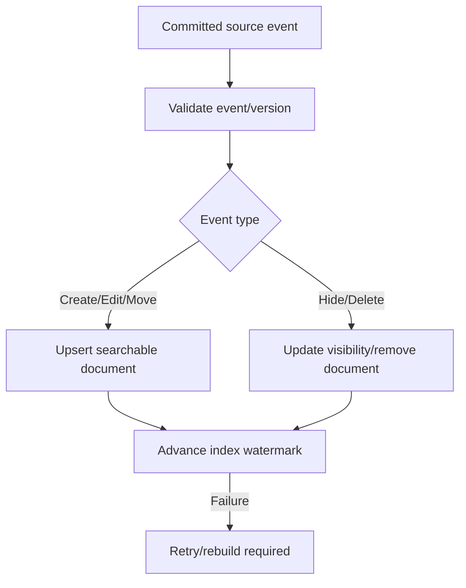

# Đặc tả nghiệp vụ hoàn chỉnh — Update Search Index

Flow này cập nhật index khi Deck/Card create, edit, move, hide hoặc delete, bảo toàn khả năng tìm đúng object hiện hành.

## 1. Nguyên tắc đã chốt

- Index là projection có thể rebuild; Deck/Card là source.
- Mutation event identity được apply tối đa một lần.
- Delete/hide invalidation loại actionable stale result theo policy.
- Move/rename cập nhật path/searchable fields atomically ở projection level.
- UI không chờ index update để coi source mutation đã commit.

## 2. Master flow

## 3. Index contract

- Document có stable object id/type, normalized searchable fields, current path và visibility.
- Parent path update cascade theo versioned hierarchy event.
- Không index Progress/Account/private fields ngoài explicit scope.

## 4. Failure và concurrency

- Same event retry idempotent; out-of-order event dùng source version guard.
- Gap/watermark corruption kích hoạt rebuild.
- Search có thể báo stale nhưng vẫn revalidate result trước open.

## 5. State matrix

- Create/edit/rename/move/hide/unhide/delete.
- Duplicate/out-of-order/missing event, bulk import, large subtree.
- Offline retry, partial failure và full rebuild handoff.

## 6. Acceptance criteria

- Index không trở thành source of truth.
- Event cũ không ghi đè source version mới.
- Hidden/deleted object không còn stale actionable result.
- Failure recover được bằng retry/rebuild.
