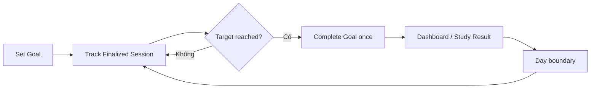

# Study Goal business flows

Study Goal sở hữu target học theo ngày và trạng thái đạt mục tiêu. Nó không tính SRS due state và không gửi notification.

## Invariants

- Một effective daily goal tại một thời điểm theo user/local profile.
- Goal dùng local-day boundary đã xác định; timezone change không double-count completion.
- Completed Study Session đóng góp theo metric đã chốt, không theo screen visit.
- Thay đổi target không sửa lịch sử session.
- Goal disabled không chặn Study.

## Primary goal flow

Session contribution được ghi bởi `track-daily-goal.md`; `complete-daily-goal.md` chỉ sở hữu transition/event; `handle-goal-day-boundary.md` sở hữu local-day bucketing.

## Flow catalog

| File | Flow sở hữu | Trạng thái |
| --- | --- | --- |
| [set-daily-study-goal.md](./set-daily-study-goal.md) | Enable/disable và chọn target | Đã có |
| [track-daily-goal.md](./track-daily-goal.md) | Aggregate contribution trong current local day | Đã có |
| [complete-daily-goal.md](./complete-daily-goal.md) | Goal-met transition và one-time feedback | Đã có |
| [handle-goal-day-boundary.md](./handle-goal-day-boundary.md) | Day/timezone rollover | Đã có |

## Cross-object contracts

- Nhận completed-session contribution từ Study Session.
- Trả current progress/target/met state cho Dashboard và Study Result.
- Reminder có thể đọc goal state để điều chỉnh copy nhưng không mutate goal.

## Canonical state coverage

- Disabled; zero/partial/met/exceeded; target changed; day rollover.
- Large target/count, timezone edge, long localized text, light/dark presentation.
