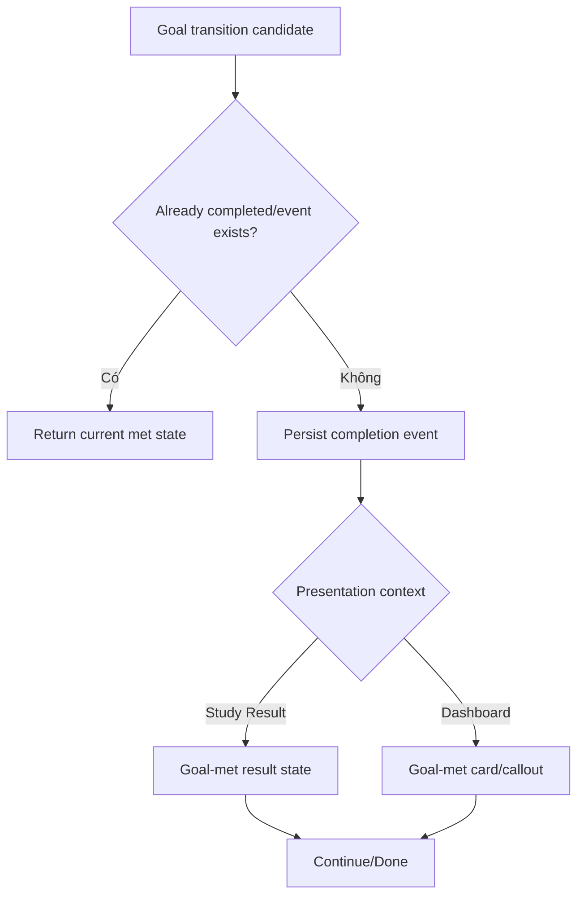

# Đặc tả UI/UX hoàn chỉnh — Complete Daily Goal

Flow này sở hữu transition từ chưa đạt → đạt Goal trong một local day và one-time feedback cho Dashboard/Study Result.

## 1. Nguyên tắc đã chốt

- Completion xảy ra khi current amount lần đầu đạt/vượt effective target.
- Một local day/config lineage phát tối đa một completion event.
- Retry/reopen Study Result không phát celebration lần nữa.
- Feedback ngắn, calm; không chặn tiếp tục học.
- Goal vượt target vẫn giữ completed state.
- Disabled Goal không phát completion.

## 2. Entry points

- `track-daily-goal.md` trả transition crossed-target.
- Target lowered trong `set-daily-study-goal.md` có thể tạo transition sau explicit Save.
- Restore/sync reconciliation có thể discover missed event nhưng phải idempotent.

# 3. Master flow



# 4. Objective, archetype và composition

- Objective: xác nhận đạt target và cho user tiếp tục.
- Archetype: Detail feedback, không phải modal bắt buộc.
- Primary CTA của surface giữ nguyên (`Continue studying` hoặc `Start review` theo context).

```text
Daily goal met
<current> of <target> completed today

[ Continue studying ]
```

- Không emoji; success meaning không chỉ dựa màu.

# 5. Event/presentation rules

- Event identity gồm local-day id + Goal lineage/version policy.
- Presentation acknowledgement tách khỏi completion persistence; dismiss không un-complete Goal.
- Nếu app đóng trước feedback, Dashboard có thể hiển thị met state nhưng không lặp disruptive feedback vô hạn.
- Raising target later có thể làm current state partial nhưng historical event không bị xóa.

# 6. Lifecycle và errors

- Completion persistence nằm trong/after contribution consistency flow.
- Failure persist event không được báo one-time feedback thành công giả.
- UI load failure vẫn hiển thị correct met state khi retry.
- Sync duplicate completion events dedupe theo identity.

# 7. State matrix

- Goal met on Study Result; Goal met on Dashboard; exceeded.
- Already acknowledged; reopened; target lowered/raised; sync discovery.
- Loading/error; long numbers/copy; large font; narrow device; light/dark.

# 8. Acceptance criteria

- Một completion event/eligible local day lineage.
- Retry/reopen/sync không duplicate feedback.
- Dismiss không đổi met state; feedback không chặn Study.
- Presentation giữ primary CTA của owning surface.
- Dashboard goal-met và Study Result goal-met parity dưới 3% mỗi theme.
