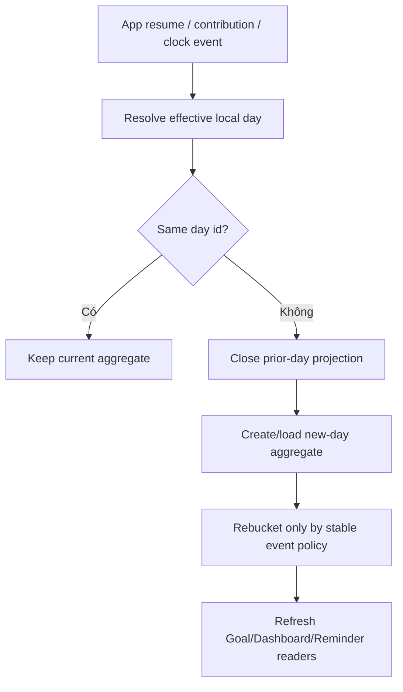

# Đặc tả nghiệp vụ hoàn chỉnh — Handle Goal Day Boundary

Flow này sở hữu cách xác định local-day id và rollover Goal progress khi ngày/timezone thay đổi. Nó không rewrite timestamps của Sessions.

## 1. Nguyên tắc đã chốt

- Goal progress được bucket theo deterministic local-day contract.
- Day rollover tạo current-day aggregate mới; không xóa history ngày trước.
- Timezone change không double-count cùng contribution.
- App background qua midnight xử lý rollover khi resume trước khi render Dashboard.
- Clock/DST change không tạo ngày trùng hoặc contribution âm.
- Streak calculation là projection từ completed-day records, không mutation ở UI.

## 2. Boundary inputs

| Input | Use |
| --- | --- |
| Contribution completed time | Stable event time |
| Effective timezone | Resolve local-day id |
| Last processed day/timezone | Detect rollover/change |
| Goal config lineage | Apply correct target |

# 3. Master flow

# 4. Rollover rules

- New day starts at zero active contribution unless events already exist for that day.
- Prior-day met/missed history immutable after normal rollover, trừ explicit reconciliation.
- Timezone change re-resolves display buckets using stable contribution ids; không apply contribution lần hai.
- Goal target effective at each day follows configuration effective-time policy.
- Offline does not block local rollover.

# 5. Edge decision table

| Case | Behavior |
| --- | --- |
| App open across midnight | Rollover before next Dashboard interaction |
| App closed several days | Materialize/read days from events; no fake activity |
| Travel timezone backward | Same contribution id remains one bucket only |
| DST forward/back | Use timezone-aware day id, not fixed-duration assumption |
| Manual clock change | Re-evaluate safely; flag impossible ordering for audit |
| Sync old contribution | Insert into correct historical day; update projections idempotently |

# 6. Error/recovery contract

- Timezone unavailable: use last known/default policy explicitly; không silently mix zones.
- Projection rebuild failure giữ raw contributions intact và retryable.
- Dashboard loading/error không mutate day state.

# 7. State matrix

- Same day; midnight rollover; multi-day gap.
- Timezone east/west travel; DST forward/back; manual clock change.
- Late sync event; projection rebuild failure/retry; offline.

# 8. Acceptance criteria

- Contribution xuất hiện đúng một local-day bucket.
- Rollover giữ history và reset current aggregate đúng.
- Timezone/DST/manual clock không double-count.
- Late sync updates historical projection idempotently.
- Dashboard render current day only after boundary resolution.
