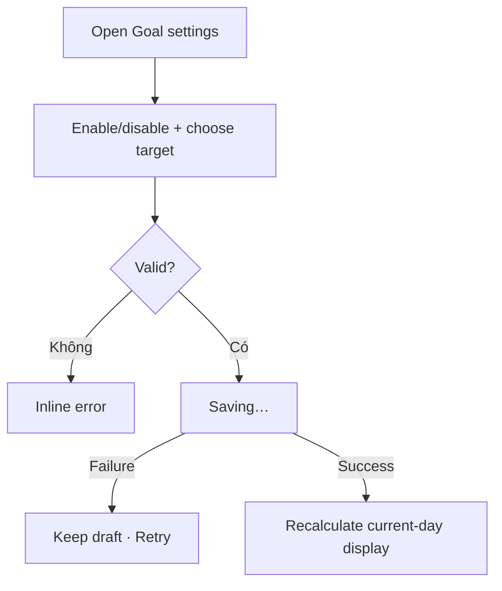

# Đặc tả UI/UX hoàn chỉnh — Set Daily Study Goal

Flow này sở hữu enable/disable và target của daily Study Goal. Nó không thay đổi due cards, completed Sessions hoặc Reminder schedule.

## 1. Nguyên tắc đã chốt

- Một effective Goal configuration tại một thời điểm.
- Enabled Goal cần positive target và supported metric/unit.
- Disable Goal không chặn Study và không xóa historical attainment.
- Đổi target áp dụng từ thời điểm effective đã chốt; không rewrite completed Sessions.
- Save atomic; failure giữ draft.
- Reminder không tự bật/tắt theo Goal nếu user chưa xác nhận riêng.

## 2. Entry points

| Context | Trigger | Presentation |
| --- | --- | --- |
| Dashboard goal card | Edit goal | Focused settings form |
| Study Settings | Daily goal | Settings form |
| First configuration | Set a goal | Optional form; không chặn Study |

# 3. Master flow



# 4. Objective, archetype và composition

- Objective: đặt daily target phù hợp mà không làm gián đoạn Study.
- Archetype: Settings/Form.
- Primary CTA: `Save`.

```text
←  Daily study goal

Daily goal                                      [ on ]

Target *
[ <supported target control>                    ]

Progress already recorded today will stay.

                                               [ Save ]
```

# 5. Validation và effective behavior

- Enabled + missing/non-positive/unsupported target → inline validation.
- Disabled: target control disabled nhưng last target có thể giữ để re-enable.
- Target change giữ current-day contribution; met state recalculate theo new target.
- Nếu lowering target chuyển partial → met, goal-met transition dùng `complete-daily-goal.md` và one-time policy.
- Nếu raising target chuyển met → partial, không thu hồi feedback/history đã phát; current display phản ánh target mới.

# 6. Submit/cancel lifecycle

- Clean Save disabled; dirty valid Save primary.
- Saving disable form/Back/double-submit.
- Failure: `Couldn’t update your daily goal. Your changes are still here.`
- Success: snackbar `Daily goal updated`; Dashboard refresh.
- Dirty Back: `Discard your goal changes?`.

# 7. State matrix

- Disabled; enabled default/custom; invalid target.
- Lower/raise target after progress; saving/failure/success; discard.
- Long localized unit, keyboard, large font, narrow device, light/dark.

# 8. Acceptance criteria

- Enabled Goal luôn valid; disabled không chặn Study.
- Target change không rewrite Session/history và giữ current contribution.
- Recalculated met state không phát duplicate completion.
- Failure giữ draft; Reminder không đổi ngầm.
- Dashboard Goal states đạt parity dưới 3% mỗi theme.
