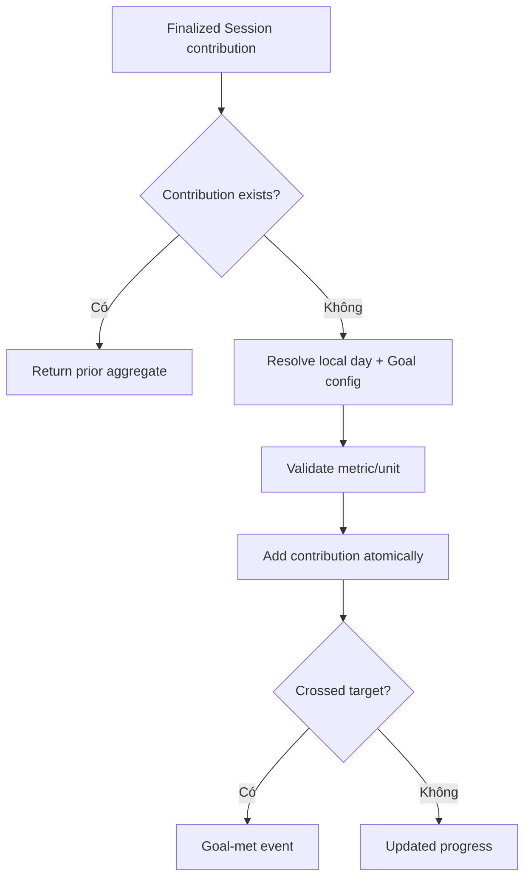

# Đặc tả nghiệp vụ hoàn chỉnh — Track Daily Goal

Flow này aggregate contribution của finalized Study Sessions vào current local day. Nó không sở hữu Session scoring hoặc Reminder delivery.

## 1. Nguyên tắc đã chốt

- Chỉ finalized Session contribution mới tăng Goal.
- Mỗi contribution có stable id và apply tối đa một lần.
- Contribution unit phải khớp Goal metric/version.
- Paused/abandoned/retried Finalize không double-count.
- Goal disabled vẫn có thể giữ activity history nhưng không tính active attainment.
- Current value không âm; over-target được phép hiển thị.

## 2. Input/output contract

| Contract | Nội dung |
| --- | --- |
| Input | Contribution id, session id, completed time, metric/unit, amount |
| Resolve | Effective local-day id + Goal config/version |
| Output | Previous/current amount, target, met transition |

# 3. Master flow

# 4. Aggregation rules

- Amount derive từ finalized summary, không screen visit/CTA tap.
- Same session/finalize retry trả same contribution identity.
- Contributions bucket theo completed time/local-day policy.
- Target config change không alter stored contribution amounts.
- Parent/Deck scope không double-count same Card activity trong one Session summary.

# 5. Error/concurrency contract

- Metric mismatch → conflict, không coerce ngầm.
- Same id/different payload → audit conflict.
- Concurrent finalize contributions serialize/atomic increment.
- Storage failure giữ finalize recoverable hoặc outbox/pending state rõ; không báo goal updated giả.

# 6. State matrix

- Zero/partial/met/exceeded; disabled Goal.
- Duplicate retry; metric mismatch; concurrent Sessions.
- Day boundary/timezone change; offline/pending contribution; storage failure.

# 7. Acceptance criteria

- Finalized Session apply đúng một contribution.
- Retry/concurrency không double-count hoặc lost update.
- Contribution gắn correct local day/config metric.
- Target change không rewrite contributions.
- Goal-met event chỉ phát khi transition thực sự xảy ra.
