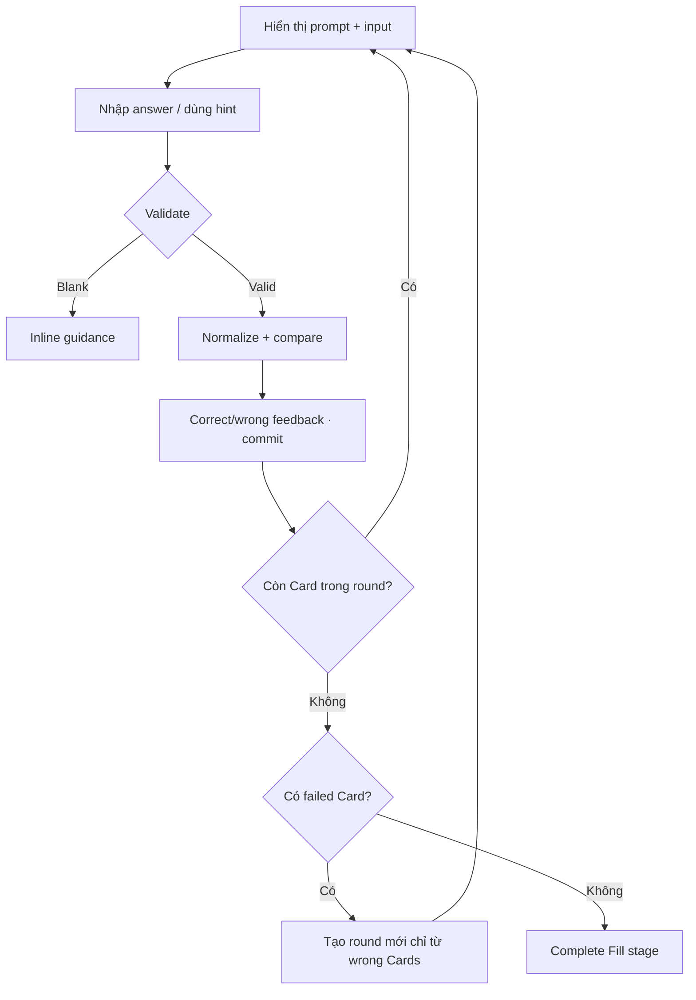

# Đặc tả UI/UX hoàn chỉnh — Fill Card Answer

Flow này nhận text answer, tùy chọn hint và so sánh theo policy đã phiên bản hóa để tạo evidence.

## 1. Nguyên tắc đã chốt

- Input được normalize theo language-aware policy, không tự dịch.
- Blank không submit; intentional diacritics/punctuation theo policy rõ.
- Hint usage được ghi trong evidence nhưng không tự quyết định SRS.
- Sau Submit, answer bị khóa cho đến Retry hoặc Next.
- Correct answer luôn được hiển thị trong feedback.
- Card trả `wrong` được đưa vào round kế; Card trả `correct` được loại khỏi mastery queue của mode.

## 2. Master flow

## 3. Objective và composition

- Objective: nhập đúng answer cho mọi Card; chỉ các Card sai được lặp lại cho đến khi một round không còn sai.
- Archetype: Focused answer form.
- Primary CTA: `Check answer`, sau feedback là `Continue`.
- Hint là secondary action; input label nêu language kỳ vọng.

## 4. Validation và lifecycle

- Trim outer whitespace; giữ nội dung có ý nghĩa theo script.
- Comparison version nằm trong evidence để tái lập kết quả.
- Card order được shuffle deterministic riêng cho mỗi Fill round; Round 1 không dùng lại nguyên Card sequence của Recall Round 1 khi có từ hai Card trở lên.
- Keyboard submit tương đương CTA; không double-submit.
- Evidence `wrong` thêm Card hiện tại vào `nextRoundFailedCardIds`; evidence `correct` không thêm Card.
- Hết round chỉ complete mode nếu failed set rỗng; nếu không, round mới dùng đúng failed set đã khử trùng và mở input trống cho attempt mới.
- Hint state thuộc từng attempt và reset khi Card bắt đầu attempt ở round mới.
- Checkpoint giữ round index, current-round order, current input state và next-round failed set.
- Resume giữ current-round order; không shuffle lại các Card đang học.
- Failure giữ text, hint state và feedback pending.

## 5. State matrix

- Empty, typing, hint used, validating, correct, wrong, round-complete, retry-round, failure.
- IME/composition, multiline/long answer, resume, final Card.
- Keyboard, large font, narrow device, light/dark.

## 6. Acceptance criteria

- Blank không tạo attempt.
- Cùng input + policy version cho cùng kết quả.
- Hint usage và normalized answer được trả trong evidence.
- Persistence Retry không tạo duplicate evidence hoặc xóa draft.
- Card `wrong` phải xuất hiện ở round kế; Card `correct` không xuất hiện lại.
- Mode chỉ complete khi round vừa hoàn tất có 0 Card `wrong`.
- Fill Round 1 và mỗi retry round dùng seed riêng; sequence collision với mode/round trước phải được resolve deterministic.
