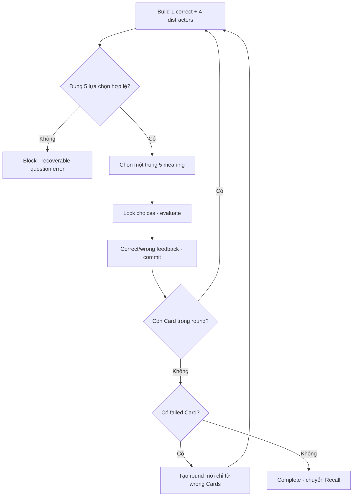

# Đặc tả UI/UX hoàn chỉnh — Guess Card Meaning

Flow này hiển thị một prompt và các lựa chọn meaning, sau đó trả evidence correct/wrong cho Study Session.

## 1. Nguyên tắc đã chốt

- Mỗi question bắt buộc hiển thị đúng `GUESS_OPTION_COUNT = 5` lựa chọn: một đáp án đúng và `GUESS_DISTRACTOR_COUNT = 4` distractor.
- Có đúng một đáp án theo Card snapshot; đáp án đúng xuất hiện đúng một lần trong option set.
- Bốn distractor có choice identity riêng, meaning hiển thị khác nhau sau normalize, không trùng đáp án đúng và không lộ đáp án bằng format.
- Distractor lấy từ stable candidate pool của toàn bộ session snapshot, không chỉ từ `currentRoundCardIds`. Vì vậy retry round còn một Card vẫn phải có đủ năm lựa chọn.
- Chỉ nhận lựa chọn đầu tiên trong một question attempt.
- Feedback giải thích đáp án đúng trước khi tiếp tục.
- Card trả `wrong` được đưa vào round kế; Card trả `correct` được loại khỏi mastery queue của mode.
- Thiếu bốn distractor hợp lệ là question/session validation error: không render ít hơn năm lựa chọn, không tạo Attempt, không skip Card và không advance checkpoint.

## 2. Master flow

## 3. Objective và composition

- Objective: chọn meaning đúng giữa năm lựa chọn cho mọi Card; chỉ các Card sai được lặp lại cho đến khi một round không còn sai.
- Archetype: Single-choice quiz.
- Primary action: một trong đúng năm choice; sau feedback là `Continue` tới Card kế trong round hoặc round retry.
- Prompt, progress và choices phải wrap đầy đủ.

## 4. Validation và lifecycle

- Choice ids ổn định trong question; resume không reshuffle.
- Option order được shuffle deterministic theo question identity; cùng question/Resume giữ nguyên năm choice và thứ tự.
- Candidate pool phải có ít nhất năm meaning khác nhau sau normalize trong cùng language-pair snapshot.
- Card question order được shuffle deterministic riêng cho mỗi Guess round và không dùng lại nguyên Card sequence của Match Round 1 khi có từ hai Card trở lên.
- Card-order shuffle và five-option shuffle là hai permutation riêng; thay option order không được thay current Card order.
- Mỗi distractor tham chiếu một Card khác current Card; không dùng hai Card có cùng meaning hiển thị để lấp đủ số lượng.
- Retry round dùng lại stable candidate pool của session snapshot, kể cả các Card nguồn distractor đã đạt ở round trước.
- Double-tap không tạo hai evidence.
- Evaluation xảy ra từ ids, không so sánh display text.
- Evidence `wrong` thêm Card hiện tại vào `nextRoundFailedCardIds`; evidence `correct` không thêm Card.
- Hết round chỉ chuyển mode nếu failed set rỗng; nếu không, round mới dùng đúng failed set đã khử trùng.
- Checkpoint giữ round index, current-round order, current question và next-round failed set.
- Resume giữ cả current-round Card order và five-option order; không shuffle lại một trong hai.
- Submit failure giữ lựa chọn và feedback để Retry.

## 5. State matrix

- Loading, waiting-five-options, correct, wrong, round-complete, retry-round, invalid-distractor-pool.
- Duplicate/long meanings, audio optional, resume/failure/complete.
- Large font, narrow device, keyboard/screen reader, light/dark.

## 6. Acceptance criteria

- Mỗi question nhận tối đa một answer evidence.
- Mỗi question có đúng năm lựa chọn: một correct và bốn distractor hợp lệ; không chấp nhận option count khác năm.
- Năm meaning hiển thị khác nhau sau normalize và không làm lộ đáp án.
- Retry round còn một Card vẫn hiển thị đúng năm lựa chọn từ stable session candidate pool.
- Không đủ bốn distractor thì không render question, không persist Attempt và không advance.
- Retry/Resume giữ nguyên question identity và order.
- Correct/wrong được trả theo canonical contract.
- Card `wrong` phải xuất hiện ở round kế; Card `correct` không xuất hiện lại.
- Mode chỉ complete khi round vừa hoàn tất có 0 Card `wrong`.
- Guess Round 1 và mỗi retry round dùng Card-order seed riêng; sequence collision với mode/round trước phải được resolve deterministic.
