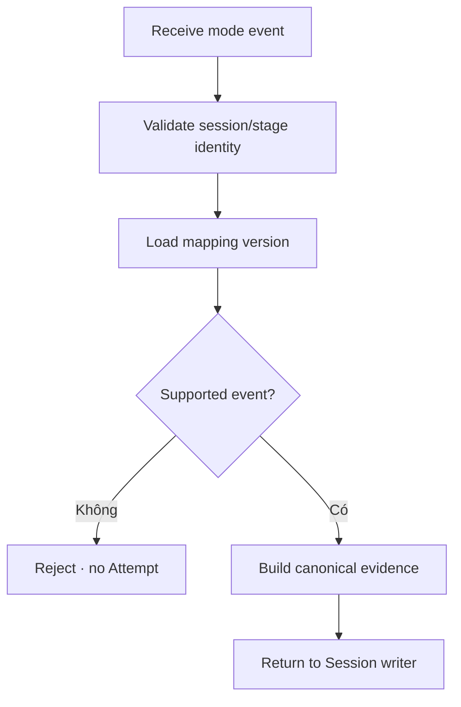

# Đặc tả nghiệp vụ hoàn chỉnh — Map Mode Outcome

Flow này chuẩn hóa event riêng của từng Study Mode thành evidence duy nhất cho `study-session/answer-study-stage.md`.

## 1. Nguyên tắc đã chốt

- Mapping deterministic theo mode, stage và formula version.
- UI color, animation, gesture hoặc localized copy không phải input.
- Evidence giữ đủ dữ liệu audit nhưng không chứa presentation state thừa.
- Unknown mode/event fail closed; không tự đoán outcome.
- Cùng event identity được map/apply tối đa một lần.

## 2. Input và output contract

| Mode | Input chính | Canonical evidence |
| --- | --- | --- |
| Review | Completed Card set | `reviewed` |
| Match | Pair event summary | score/error summary |
| Guess | Question id, five-option set, selected/correct choice ids | `correct` / `wrong` |
| Recall | UI Remembered/Forgot action hoặc timer-expired event | `correct` / `wrong` + optional reason metadata |
| Fill | Normalized comparison + hint | `correct` / `wrong` + metadata |

## 3. Mastery classification

| Mode | Passing | Non-passing |
| --- | --- | --- |
| Review | `reviewed` | Không áp dụng |
| Match | Pair đúng mà chưa có wrong/almost trong round | Pair có bất kỳ `wrong` hoặc `almost` trong round |
| Guess | `correct` | `wrong` |
| Recall | `correct` từ UI Remembered | `wrong` từ UI Forgot hoặc timeout |
| Fill | `correct` | `wrong` |

- Evidence của graded mode phải giữ `roundIndex`, Card/pair identity và attempt identity để Session dựng retry round deterministic.
- Guess event chỉ hợp lệ khi option set có đúng năm choice identities gồm một correct và bốn distractor; malformed option count fail closed và không tạo evidence.
- Recall timeout event chỉ hợp lệ với timer identity/version, threshold 20 giây và elapsed active time đã đạt deadline; event hợp lệ map deterministic thành canonical `wrong` với metadata `reason = timeout`.
- Manual reveal/self-grade và timeout dùng một resolution identity; event đến sau khi resolution đã commit trả prior result hoặc conflict, không tạo grade thứ hai.
- `remembered` và `forgot` không được xuất hiện trong canonical evidence/outcome column hoặc DB enum; chúng chỉ tồn tại trong presentation event/state trước mapping.
- Mapper chỉ phân loại passing/non-passing; Study Session sở hữu việc khử trùng failed set, tạo round mới và quyết định chuyển mode.
- Persistence Retry của cùng event trả prior mapping; attempt ở mastery round mới có identity mới.

## 4. Master flow

## 5. Error và compatibility

- Missing identity/version: validation error.
- Duplicate same event: trả prior mapping.
- Same identity/different payload: conflict.
- Version cũ vẫn đọc được; không remap history im lặng.

## 6. State matrix

- Tất cả supported modes; terminal/non-terminal.
- Duplicate, conflict, unknown event/version, malformed payload.
- Retry/offline/resume và backward-compatible evidence.
- Passing/non-passing cho mọi graded mode và nhiều `roundIndex` liên tiếp.

## 7. Acceptance criteria

- Mọi Attempt chỉ nhận canonical evidence đã validate.
- Mapping không phụ thuộc UI representation.
- Unsupported event không ghi history/progress.
- Formula version đủ để audit và replay deterministic.
- Cùng committed evidence luôn tạo cùng mastery classification.
