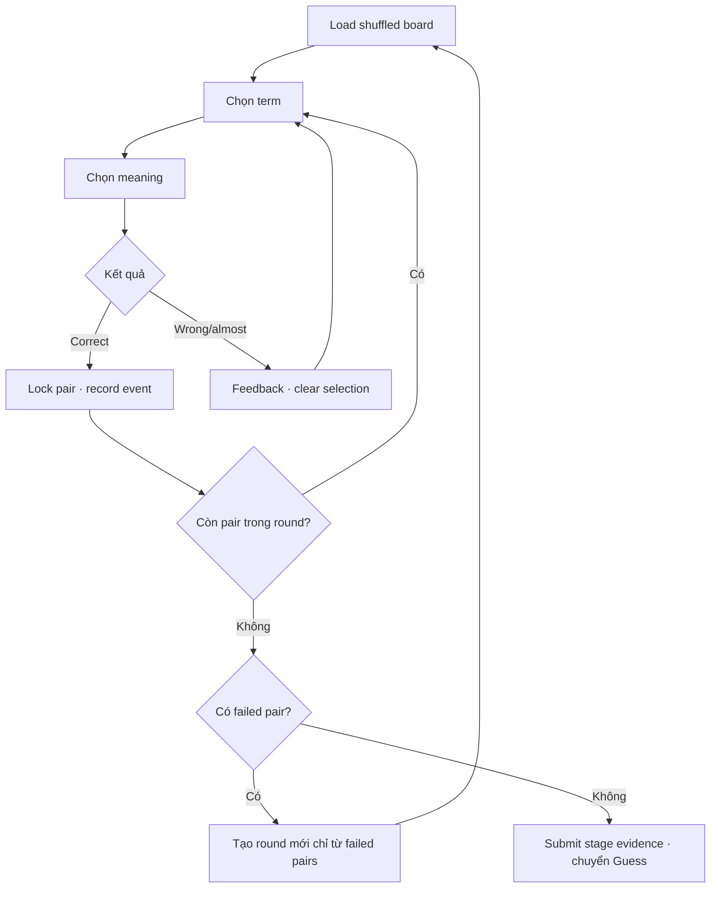

# Đặc tả UI/UX hoàn chỉnh — Match Terms and Meanings

Flow này sở hữu interaction ghép term với meaning và tạo evidence tổng kết cho stage Match.

## 1. Nguyên tắc đã chốt

- Mỗi tile thuộc đúng một pair trong snapshot round.
- Một tile chỉ có tối đa một selection active.
- Correct pair được khóa/rời bàn; wrong/almost không làm mất pair.
- Round đầu chứa toàn bộ pair của stage; round sau chỉ chứa pair từng có `wrong` hoặc `almost` trong round vừa xong.
- Pair đã có `wrong` hoặc `almost` vẫn thuộc tập failed của round, kể cả sau đó được ghép đúng để rời bàn.
- Card/pair order được shuffle deterministic riêng cho mỗi Match round; tile placement tiếp tục shuffle mà không thay đổi identity hoặc đáp án.
- Match Round 1 không dùng lại nguyên Card sequence của Review khi có từ hai Card trở lên; retry round không giữ nguyên failed-card sequence của round trước.
- Drag không phải cách tương tác duy nhất; tap-to-pair luôn khả dụng.

## 2. Master flow

## 3. Objective và composition

- Objective: ghép đúng toàn bộ pair; các pair từng sai được lặp qua nhiều round cho đến khi một round không còn lỗi.
- Archetype: Matching board.
- Primary action: chọn hai tile; `Continue` chỉ hiện khi mode complete và không còn failed pair.
- Progress và feedback dùng text/icon ngoài color.

## 4. Rules và lifecycle

- Duplicate labels vẫn phân biệt bằng pair identity, không bằng text.
- Wrong feedback ngắn, không reorder board hiện tại.
- Attempt thuộc Card/pair của term được chọn. Meaning bị chọn nhầm không tự đánh dấu Card sở hữu meaning đó là failed.
- `wrong` và `almost` thêm Card/pair của term vào `nextRoundFailedCardIds` theo identity và không duplicate.
- Correct pair được khóa trong board hiện tại. Nếu pair chưa từng sai trong round thì pair không vào round kế; nếu đã từng sai thì vẫn phải xuất hiện ở round kế.
- Khi board rỗng, chỉ complete mode nếu `nextRoundFailedCardIds` rỗng; ngược lại tăng `roundIndex` và tạo board mới từ đúng tập failed đó.
- Checkpoint gồm round index, current-round order, remaining pairs, next-round failed set, selection và event summary.
- Checkpoint giữ cả Card/pair order và tile order; Resume không shuffle lại board.
- Submit/retry idempotent; resume dựng lại cùng board order.

Ví dụ stage có 10 Card:

| Round | Card đầu round | Card không đạt | Kết quả |
| ---: | ---: | ---: | --- |
| 1 | 10 | 5 | Round 2 chỉ gồm 5 Card này |
| 2 | 5 | 3 | Round 3 chỉ gồm 3 Card này |
| 3 | 3 | 2 | Round 4 chỉ gồm 2 Card này |
| 4 | 2 | 0 | Complete Match và chuyển Guess |

Nếu Round 4 vẫn còn Card không đạt thì tiếp tục Round 5; không có giới hạn số round.

## 5. State matrix

- Idle, one selected, correct, wrong, almost, round-complete, retry-round, complete.
- Duplicate/long labels, minimum/dense board, resume/failure.
- Large font, reduced motion, narrow device, light/dark.

## 6. Acceptance criteria

- Không thể match tile ngoài cùng round hoặc match một tile hai lần.
- Correct/wrong/almost được chuẩn hóa không phụ thuộc animation.
- Resume giữ round index, board order, remaining pairs và failed set.
- Match Round 1 và mỗi retry round dùng seed riêng; cùng checkpoint luôn dựng cùng board order.
- Mỗi round kế tiếp chứa đúng tập pair không đạt đã khử trùng của round trước.
- Complete chỉ khi mọi pair đã resolved và round vừa hoàn tất không có `wrong` hoặc `almost`.
