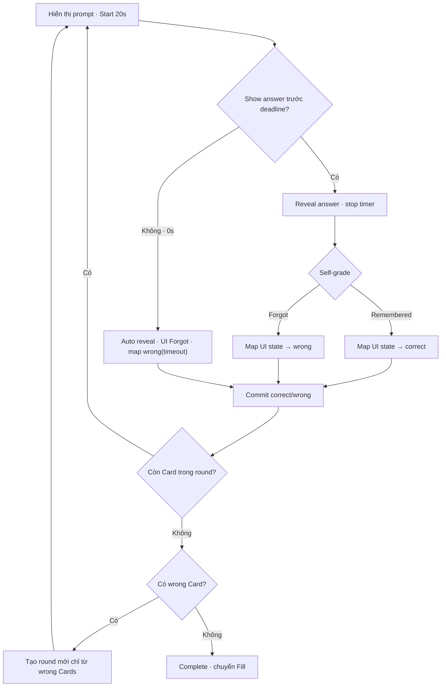

# Đặc tả UI/UX hoàn chỉnh — Recall and Self-grade

Flow này cho người học tối đa 20 giây để tự nhớ meaning, reveal đáp án rồi chọn trạng thái UI Remembered hoặc Forgot. Domain/DB chỉ nhận canonical `correct` hoặc `wrong`.

## 1. Nguyên tắc đã chốt

- Không cho self-grade trước Reveal.
- Reveal không tự được xem là Remembered.
- `RECALL_RESPONSE_TIMEOUT_SECONDS = 20`; countdown hiển thị trực tiếp trong nút `Show answer`.
- Remembered/Forgot chỉ là label, action và feedback state trên màn hình; không phải domain outcome hoặc giá trị persist.
- Mapping bắt buộc: UI `Remembered → correct`; UI `Forgot → wrong`; system timeout `→ wrong` với metadata `reason = timeout`.
- Canonical `wrong` là outcome không đạt và đưa Card vào round kế; canonical `correct` loại Card khỏi mastery queue của mode.
- Timeout trước khi bấm `Show answer` tự reveal đáp án, hiển thị Forgot, khóa canonical outcome thành `wrong` và đưa Card vào round kế.
- Self-grade chỉ nhận một lần cho Card attempt hiện tại.
- Screen reader phải đọc trạng thái reveal và lựa chọn grade.

| Presentation event/state | Canonical outcome | Persisted metadata |
| --- | --- | --- |
| User chọn `Remembered` | `correct` | Không persist label Remembered |
| User chọn `Forgot` | `wrong` | Không persist label Forgot |
| Countdown hết 20 giây | `wrong` | `reason = timeout` + timer audit fields |

## 2. Master flow

## 3. Objective và composition

- Objective: đưa mọi Card tới canonical `correct` qua UI Remembered; Card canonical `wrong` qua UI Forgot/timeout được lặp ở round kế.
- Archetype: Flashcard recall.
- Primary CTA trước reveal: `Show answer · 20s`, countdown tới `Show answer · 0s`; sau manual reveal là `Remembered` và `Forgot`.
- Sau timeout, đáp án được reveal cùng feedback `Time’s up · Forgot`; không hiển thị grade `Remembered` cho attempt đó.
- Hai grade có label/icon/semantics, không chỉ khác màu.

## 4. Lifecycle

- Timer bắt đầu khi prompt đã render thành công, app ở foreground và `Show answer` enabled; loading không trừ thời gian.
- Timer đo active interaction time, pause khi app background, Exit confirm hoặc system interruption và tiếp tục từ `remainingMs`; không reset về 20 giây khi Resume.
- Reveal state, `remainingMs`, timer version và resolution state được checkpoint để Resume không che lại đáp án hoặc chạy lại timeout.
- Bấm `Show answer` trước deadline dừng timer rồi mở self-grade. Tại deadline, chỉ một event thắng: tap có event time nhỏ hơn deadline là manual reveal; tại/sau deadline là timeout.
- Timeout tạo canonical `wrong` với metadata `reason = timeout`, threshold/version và elapsed time; cùng timer-resolution identity chỉ commit tối đa một lần.
- Grade locks controls trong khi submit.
- Card order được shuffle deterministic riêng cho mỗi Recall round; Round 1 không dùng lại nguyên Card sequence của Guess Round 1 khi có từ hai Card trở lên.
- Failure giữ reveal + selected UI state + pending canonical outcome và cho Retry.
- Save failure sau timeout giữ auto-reveal + timeout feedback; Persistence Retry không restart timer hoặc cho đổi grade.
- Success chuyển Card kế tiếp trong round đúng một lần.
- Hết round chỉ complete mode nếu không có canonical `wrong`; nếu có, round mới dùng đúng tập Card failed đã khử trùng.
- Checkpoint giữ round index, current-round order, reveal/UI state, pending canonical outcome và `nextRoundFailedCardIds`.
- Resume giữ current-round order; không shuffle lại các Card đang học.
- Attempt mới của Card ở retry round bắt đầu lại đủ 20 giây; đây là attempt identity mới.

## 5. Countdown accessibility

- Countdown luôn hiển thị bằng text trong button, không chỉ bằng vòng màu/animation.
- Accessible name nêu hành động và thời gian còn lại. Screen reader không announce mỗi giây; announce các mốc 10 giây, 5 giây và `Time’s up`.
- Large font/long localization không được cắt action hoặc số giây; reduced motion không thay đổi deadline.

## 6. State matrix

- Countdown-20s, countdown-10s, countdown-5s, manual-revealed, timeout-revealed, remembered, forgot-explicit, forgot-timeout.
- Background/paused timer, resume-with-remaining-time, deadline race, timeout save failure/retry.
- Round-complete, retry-round, submitting/failure.
- Long answer, optional audio, resume, final Card.
- Large font, narrow device, reduced motion, light/dark.

## 7. Acceptance criteria

- Không có evidence trước Reveal.
- Nút `Show answer` hiển thị countdown từ 20 giây; loading time không bị tính.
- Bấm trước deadline mở self-grade và không tạo timeout evidence.
- Hết 20 giây active interaction mà chưa bấm sẽ auto-reveal, hiển thị Forgot, commit đúng một canonical `wrong(reason = timeout)` và đánh dấu Card không đạt.
- Sau timeout không thể đổi UI thành Remembered hoặc canonical outcome thành `correct` trong cùng attempt.
- Background/Exit interruption giữ thời gian còn lại; Resume không reset timer. Retry round mới reset về 20 giây.
- Tap/deadline race tạo đúng một resolution và tối đa một Attempt.
- Mỗi Card attempt persist tối đa một canonical outcome: `correct` hoặc `wrong`.
- Resume giữ đúng mặt Card và grade pending.
- Manual self-grade mapping không phụ thuộc gesture/color. Chỉ timeout branch phụ thuộc validated active-time deadline 20 giây.
- UI `Forgot`/timeout phải map thành `wrong` và Card xuất hiện ở round kế; UI `Remembered` phải map thành `correct` và Card không xuất hiện lại.
- Mode chỉ complete khi round vừa hoàn tất có 0 canonical `wrong`.
- Recall Round 1 và mỗi retry round dùng seed riêng; sequence collision với mode/round trước phải được resolve deterministic.
