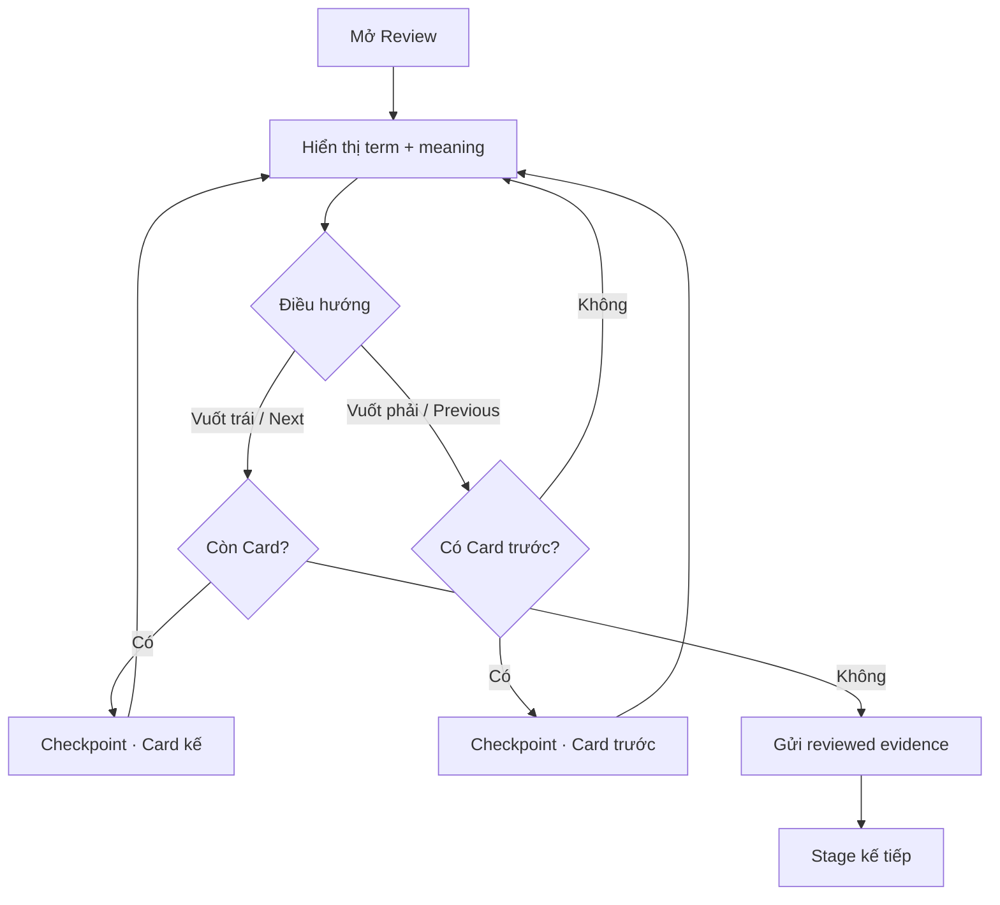

# Đặc tả UI/UX hoàn chỉnh — Review Cards

Flow này cho người học xem nhanh term và meaning của từng Card trong snapshot trước các stage có chấm điểm. Review tạo evidence hoàn tất stage nhưng không tự cập nhật SRS.

## 1. Nguyên tắc đã chốt

- Chỉ hiển thị Card thuộc snapshot của Study Session.
- Term và meaning luôn hiển thị đồng thời để người học review nhanh, không có bước Reveal.
- Review không có outcome đúng/sai và không tạo mastery retry round.
- Card order của Review là deterministic shuffle riêng của `Review/round 1`, được persist để Previous/Next và Resume dùng cùng sequence.
- Vuốt trái chuyển sang Card kế tiếp; vuốt phải quay lại Card trước đó.
- Edit và audio là hành động phụ, không thay thế CTA tiếp tục.
- Resume trở lại đúng Card và vị trí đã checkpoint.
- Card lỗi nội dung được skip có ghi nhận, không tự xóa khỏi Deck.

## 2. Master flow

## 3. Objective và composition

- Objective: review nhanh toàn bộ Card trong vòng hiện tại bằng cách xem term và meaning cùng lúc.
- Archetype: Focused study player.
- Primary CTA: `Next`; ở Card cuối đổi thành `Finish`.
- Secondary control: `Previous`; disabled ở Card đầu tiên.
- Header có progress, Exit; content có term, meaning, audio và Card actions hợp lệ.

## 4. Interaction và lifecycle

- Vuốt trái là alias của `Next`; vuốt phải là alias của `Previous`. Hai hướng đều phải có control và keyboard shortcut truy cập được, không phụ thuộc gesture duy nhất.
- Vuốt phải ở Card đầu tiên không đổi Card; `Previous` vẫn disabled.
- Audio loading/failure không chặn Previous, Next hoặc Finish.
- Edit quay về cùng checkpoint; snapshot chỉ đổi theo explicit refresh policy.
- Quay lại Card đã xem không tạo reviewed evidence trùng; checkpoint lưu vị trí hiện tại và tập Card đã xem.
- Re-render hoặc Resume không shuffle lại Review order.
- Submit cuối stage idempotent; failure giữ Card cuối và cho Retry.

## 5. State matrix

- Loaded, navigating forward/backward, audio loading/error, editing return.
- Minimum/dense round, long multilingual text, missing audio.
- Resume, finalizing, failure, large font, narrow device, light/dark.

## 6. Acceptance criteria

- Mỗi Card snapshot được review đúng một lần theo checkpoint.
- Term và meaning của Card hiện tại cùng hiển thị ngay khi Card được tải; không có trạng thái hoặc CTA Reveal.
- Vuốt trái chuyển đúng một Card về phía trước; vuốt phải chuyển đúng một Card về phía sau khi Card trước tồn tại.
- Next/Previous và keyboard shortcut cung cấp hành vi tương đương cho người không dùng gesture.
- Hoàn tất trả canonical `reviewed`, không schedule SRS.
- Review chuyển sang Match sau khi toàn bộ Card đã được browse; không áp dụng điều kiện `nextRoundFailedCardIds`.
- Exit/Resume không mất vị trí hoặc tạo completion trùng.
- Review order không được tái sử dụng nguyên sequence làm order Round 1 của Match khi có từ hai Card trở lên.
