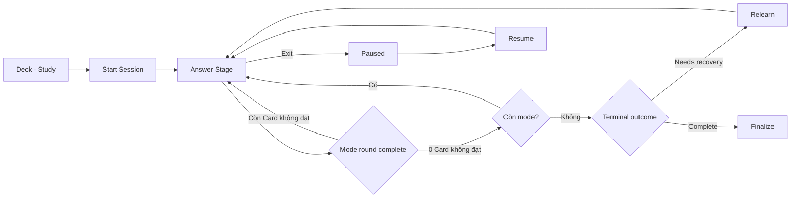

# Study Session business flows

Study Session sở hữu một lần học từ start snapshot tới finalize. Deck cung cấp scope; Flashcard cung cấp content; Learning Progress nhận outcomes.

## Invariants

- Session bắt đầu với stable Deck/card scope snapshot.
- Một active session có status rõ: starting, active, paused/recoverable, finalizing hoặc completed.
- Mỗi answer stage được persist trước khi chuyển tiếp.
- Review hoàn tất sau một lượt browse; Match, Guess, Recall và Fill chỉ hoàn tất khi mastery round vừa xong không còn Card không đạt.
- Card không đạt của một graded mode phải được lặp trong mode đó cho đến khi đạt; không được chuyển mode khi `nextRoundFailedCardIds` còn phần tử.
- Mỗi mode/round có deterministic shuffled Card order riêng; mode mới không kế thừa nguyên sequence của mode trước và Resume không reshuffle.
- Retry không tạo duplicate attempt.
- Exit không âm thầm mất progress đã persist.
- Finalize idempotent; retry không nhân đôi result/progress.

## Primary learning flow

Thứ tự source of truth: `deck/study-deck.md` → `start-study-session.md` → `answer-study-stage.md` → `relearn-cards.md` khi cần → `finalize-study-session.md`. `exit-study-session.md` và `resume-study-session.md` là nhánh interruption/recovery.

Mastery-round state, Relearn queue và due-review queue là ba phần checkpoint riêng; không dùng Relearn thay cho retry round trong mode.

## Flow catalog

| File | Flow sở hữu | Trạng thái |
| --- | --- | --- |
| [start-study-session.md](./start-study-session.md) | Validate scope/mode và tạo session snapshot | Đã có |
| [resume-study-session.md](./resume-study-session.md) | Load active session, resume error và start-fresh decision | Đã có |
| [answer-study-stage.md](./answer-study-stage.md) | Submit answer, persist attempt và advance stage | Đã có |
| [exit-study-session.md](./exit-study-session.md) | Exit confirm, saved progress và destination | Đã có |
| [finalize-study-session.md](./finalize-study-session.md) | Finalizing, result summary, retry và completion | Đã có |
| [relearn-cards.md](./relearn-cards.md) | Relearn/due-review branches trong current session | Đã có |

## Cross-object contracts

- Nhận Deck id, Card ids, mode và scope từ `deck/study-deck.md`.
- Nhận immutable Card content snapshot hoặc stable ids có version contract.
- Phát Attempt outcomes cho Learning Progress.
- Phát completed summary cho Goal/Statistics projections.

## Canonical state coverage

- Start/default/not-enough/failure; five stages; answer-save error.
- Exit confirm; resume error; relearn/due-review; finalizing/finalize error/result.
- Long content, large font, narrow device, offline, light/dark.
