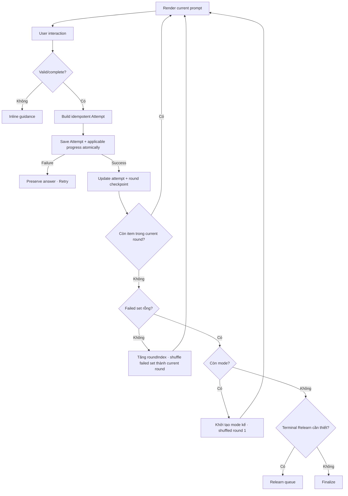

# Đặc tả UI/UX hoàn chỉnh — Answer Study Stage

Flow này sở hữu submit answer cho năm Study stages, persist Attempt và advance checkpoint. Learning Progress sở hữu scheduling state.

## 1. Nguyên tắc đã chốt

- Mỗi submit có attempt id/idempotency key duy nhất.
- Answer phải persist trước khi checkpoint advance.
- Save failure giữ answer/feedback và cho Retry.
- Retry cùng attempt không tạo record hoặc progress update lần hai.
- Stage attempts được ghi riêng; SRS schedule chỉ apply khi Card round có terminal outcome.
- Không cho Next khi required interaction chưa hoàn tất.
- Review không có pass/fail. Với Match, Guess, Recall và Fill, stage không được advance sang mode kế khi `nextRoundFailedCardIds` còn phần tử.
- Mastery retry round thuộc stage hiện tại và khác với persistence Retry cũng như terminal Relearn queue.

## 2. Stage contract

| Stage | Required interaction | Passing | Non-passing |
| --- | --- | --- | --- |
| Review | Browse term + meaning complete | `reviewed` | Không áp dụng |
| Match | Match all required pairs | Pair đúng ngay trong round | Pair có `wrong`/`almost` trong round |
| Guess | Select một trong đúng 5 meaning choices | `correct` | `wrong` |
| Recall | Reveal + UI self-grade trước deadline, hoặc 20s timeout | `correct` | `wrong` |
| Fill | Submit typed answer | `correct` | `wrong` |

# 3. Master flow

# 4. Objective, archetype và composition

- Objective: hoàn tất interaction hiện tại và lưu kết quả an toàn.
- Objective cấp mode: đưa mọi Card tới passing outcome trước khi chuyển mode.
- Archetype: Focused task/study flow.
- Một primary CTA theo stage: `Next`, `Check`, `Got it` hoặc action canonical của mode.

Composition cố định: progress header → prompt → interaction/feedback → primary action → recoverable feedback area.

# 5. Validation và scoring boundary

- UI/stage xác định evidence; Progress policy chuyển terminal evidence thành next schedule.
- Hint usage được persist như evidence, không tự định nghĩa interval tại UI.
- Self-grade là explicit user outcome, không suy từ thời gian.
- Empty/invalid answer không tạo Attempt.
- Guess option set khác đúng năm choice hoặc không có đúng một correct là invalid interaction, không tạo Attempt và không advance checkpoint.
- Recall timer expiry là required interaction hợp lệ do system tạo; nó commit canonical `wrong` với metadata timeout và thêm Card vào failed set như UI Forgot.
- Recall tap/deadline race được serialize theo timer-resolution identity; một Card attempt chỉ có một canonical `correct` hoặc `wrong`.
- Long answer comparison không truncate ký tự quan trọng.
- Outcome không đạt được thêm vào `nextRoundFailedCardIds` theo Card identity; thêm lặp lại vẫn chỉ tạo một entry.
- Outcome đạt không xóa một Card đã bị đánh dấu failed trước đó trong cùng round. Card đó vẫn phải học lại ở round kế.
- Hết round với failed set khác rỗng là round completion, không phải stage completion và không phải terminal Card outcome.
- Order của mode/round mới được tạo deterministic trước khi checkpoint advance; không đổi membership và không được giống nguyên sequence trước khi có từ hai Card trở lên.

# 6. Submit lifecycle

- Waiting: CTA disabled cho đến required interaction.
- Feedback domain dùng correct/wrong/almost; Recall presentation map correct→Remembered và wrong→Forgot, không chỉ dùng màu.
- Saving: disable interaction/Back/double-submit; announce saving.
- Failure dialog: `Couldn’t save your answer. Your answer is still here.` + `Try again`.
- Success: checkpoint advance đúng một lần tới item kế, mastery round kế hoặc mode kế theo round state; không flash lại old question.

# 7. Atomic handoff

1. Persist Attempt với session/card/stage/request id.
2. Nếu terminal Card outcome: call `record-study-attempt.md` và `schedule-next-review.md` trong cùng consistency boundary.
3. Persist `mode`, `roundIndex`, `shuffleVersion`, generated `currentRoundCardIds` order, current position và `nextRoundFailedCardIds` hoặc terminal queue tương ứng.
4. Commit; failure rollback boundary hoặc đánh dấu recoverable pending operation rõ ràng.

# 8. Back, exit và concurrency

- Back/X mở Exit flow; không bypass unsaved answer state.
- App background khi Saving: resolve transaction on resume before enable Retry.
- Stale session writer bị conflict; không apply answer ngoài current checkpoint.
- Card content update bên ngoài không đổi current prompt snapshot.

# 9. Error copy

| Case | Copy |
| --- | --- |
| Required interaction | `Complete this step before continuing.` |
| Save failure | `Couldn’t save your answer. Your answer is still here.` |
| Stale checkpoint | `This session changed elsewhere. Reload your saved progress.` |
| Missing prompt | `This card is no longer available. Continue with the next card.` |

# 10. State matrix

- Stage 1–5 waiting/interaction/correct/wrong/round-complete/retry-round/complete.
- Almost, hint, Recall UI Forgot/Remembered mapped to wrong/correct, long text, keyboard.
- Saving, answer-save-error, retry success, stale conflict, missing Card.
- Large font, narrow device, light/dark for canonical states.

# 11. Acceptance criteria

- Attempt saved before advance; retry không duplicate.
- Save error giữ answer và feedback.
- Graded mode không advance khi `nextRoundFailedCardIds` còn phần tử.
- Round kế chứa đúng tập Card không đạt đã khử trùng của round trước; không đưa lại Card đã đạt.
- Số mastery round không bị giới hạn; mode complete chỉ khi round vừa xong có 0 Card không đạt.
- Mode/round transition tạo order mới; Resume/retry cùng checkpoint giữ nguyên order.
- Terminal Card outcome schedule đúng một lần.
- Required interaction/invalid answer không persist.
- Stale writer không mutate checkpoint/progress.
- Five stage canonical states và answer-save-error parity dưới 3% mỗi theme.
