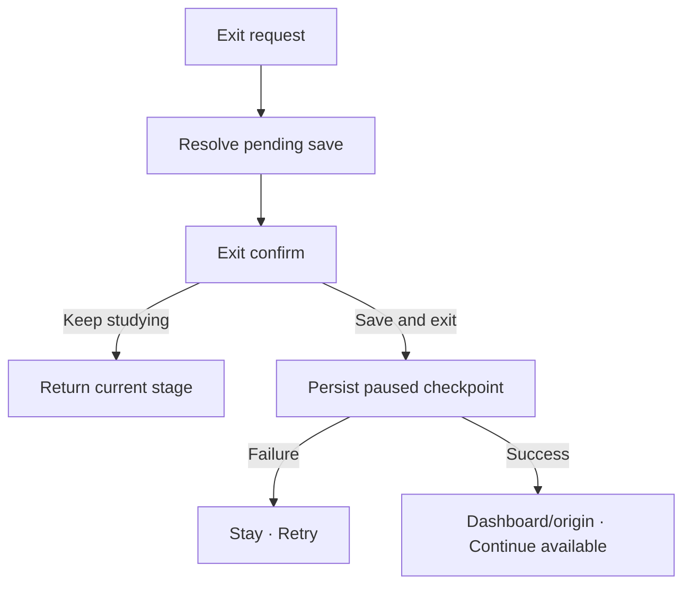

# Đặc tả UI/UX hoàn chỉnh — Exit Study Session

Flow này sở hữu rời session chưa hoàn tất. Nó bảo toàn mọi checkpoint đã commit và không xem Exit là Finalize.

## 1. Nguyên tắc đã chốt

- X/Back trong active session luôn mở confirm.
- Answer đã commit giữ nguyên; answer đang nhập nhưng chưa commit không được báo đã lưu.
- `Save and exit` chuyển session sang paused/resumable.
- `Keep studying` đóng dialog và trả focus đúng interaction.
- Exit không tạo completed summary hoặc goal contribution.
- Không có destructive `Discard all progress` trong confirm mặc định.

## 2. Entry points

- X/Back từ bất kỳ Stage 1–5.
- X/Back trong relearn/due-review.
- App/system request rời focused flow khi user còn tương tác.

# 3. Master flow



# 4. Composition

```text
Leave this session?

Your saved answers will be here when you return.
The current unfinished answer may need to be entered again.

Keep studying                         Save and exit
```

- Archetype: destructive/interrupt confirmation.
- Safe primary in focused context: `Keep studying`.

# 5. Pending-answer rules

| Current state | Exit behavior |
| --- | --- |
| Waiting/typing, not submitted | Warn unfinished input not saved |
| Saving answer | Wait/resolve save before exit decision completes |
| Save failure | Keep error state; user retries or exits to committed checkpoint |
| Feedback committed | Resume at next committed checkpoint |
| Recall countdown trước reveal | Pause và persist `remainingMs`; Resume tiếp tục, không reset |
| Recall timeout đang save/đã commit | Resolve save như Attempt khác; không cho đổi thành Remembered |

- Với graded mode, paused checkpoint gồm round index, current-round order, current position và next-round failed set đã commit.

# 6. Lifecycle

- Confirm: focus Keep studying; trap/restore focus.
- Exiting: `Saving…`; disable actions/double-submit.
- Failure: `Couldn’t save the session checkpoint. Keep studying or try again.`
- Success: session paused; origin shows `Continue session`.
- App force-close uses last committed checkpoint; không giả lập confirm.

# 7. Navigation

- Default success destination là origin/Dashboard theo entry contract.
- Continue mở `resume-study-session.md`.
- Deck moved: Continue resolve by id.
- Deck deleted: Continue handles snapshot/deleted-return rules.

# 8. State matrix

- Exit from Stage 1–5, relearn, due-review.
- Clean checkpoint; unfinished input; saving; answer-save-error.
- Pausing/failure/success; app background/force-close.
- Long copy, large font, narrow device, light/dark.

# 9. Acceptance criteria

- Exit không mất committed attempts hoặc finalize session.
- Uncommitted input không được mô tả là đã lưu.
- Pause failure giữ user trong session với recovery.
- Continue trở đúng checkpoint và không duplicate Attempt.
- Continue không mất failed set, không đưa Card đã đạt trở lại và không chuyển mode sớm.
- Continue Recall giữ timer resolution/remaining time và không tạo timeout evidence trùng.
- Exit canonical state parity dưới 3% mỗi theme.
