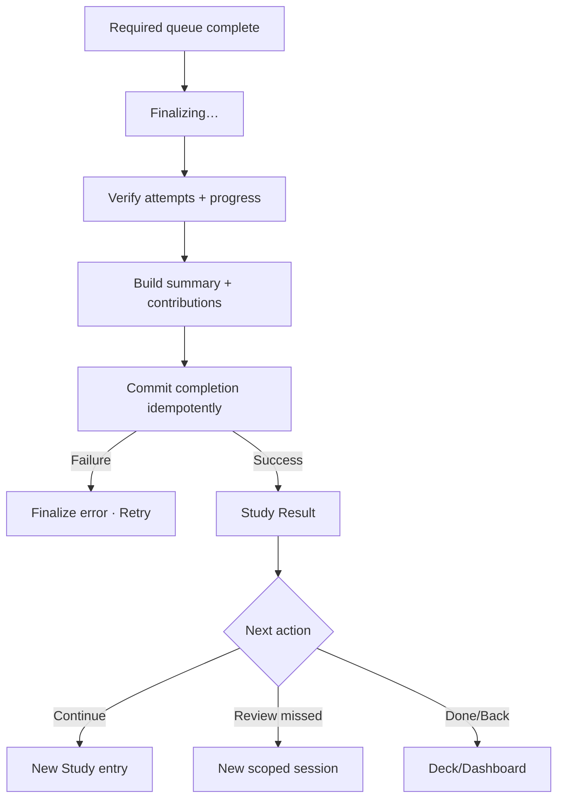

# Đặc tả UI/UX hoàn chỉnh — Finalize Study Session

Flow này đóng session đã hết required queue, tạo summary và phát contribution đúng một lần cho Goal/Statistics.

## 1. Nguyên tắc đã chốt

- Chỉ finalize khi không còn pending required answer/save, mastery-round item hoặc relearn item.
- Finalize idempotent theo session id.
- Completed status, summary và outbound contributions nhất quán.
- Retry không nhân đôi progress, goal hoặc statistics events.
- Finalize failure giữ session ở finalizing/recoverable, không quay last answer.
- Result chỉ hiển thị số liệu đã commit.

## 2. Preconditions và outputs

| Contract | Nội dung |
| --- | --- |
| Input | Session snapshot, committed Attempts, final checkpoint |
| Validate | Mọi graded mode có final failed set rỗng; mastery/Relearn/due-review queues rỗng; không có pending writes |
| Output | Completed status, finalized time, summary, goal/stat contribution ids |

# 3. Master flow



# 4. Objective, archetype và composition

- Finalizing objective: commit session safely; không có CTA khi đang xử lý.
- Result objective: hiểu outcome và chọn next action.
- Archetype: Detail.
- Primary CTA theo result: `Continue studying`; secondary `Done`/`Review missed` theo state.

```text
Session complete

<reviewed count> cards
<accuracy / remembered / missed summary>
<goal status when applicable>

[ Continue studying ]
  Done
```

# 5. Summary rules

- Counts derive từ committed Attempts, không UI events.
- Accuracy denominator/rounding phải nhất quán và localized.
- Missed list dùng terminal Card outcome, không double-count stage failures.
- Result có thể hiển thị copy Remembered/Forgot cho Recall, nhưng summary logic phải derive từ persisted `correct/wrong`; không đọc DB outcome `remembered/forgot`.
- Goal contribution phát một lần với stable event id.
- Empty/invalid summary chặn Result và đi finalize recovery.
- Attempt ở các mastery round đều được giữ để tính lịch sử; summary Card không double-count vì một Card xuất hiện nhiều round.

# 6. Lifecycle

- Finalizing: stable progress/status; disable Back/double-finalize.
- Failure: `Couldn’t finish saving this session. Your answers are safe.` + `Try again`.
- Retry: same finalize request identity.
- Success: mark completed before Result; active-session CTA biến mất.
- Result navigation không mutate completed summary.

# 7. Result branches

| Condition | Feedback | Primary next |
| --- | --- | --- |
| Standard | Session summary | Continue studying |
| Goal met | One-time goal feedback | Continue/Done |
| Goal missed | Remaining context | Continue studying |
| Many wrong | Missed count | Review missed |
| No more eligible cards | Completion copy | Done |

# 8. Concurrent/offline

- Finalize local hoạt động offline.
- Repeated finalize from resume/device returns same completed result.
- Deck/Card changed after snapshot không rewrite summary.
- Deck deleted before return: Done → Library.

# 9. State matrix

- Blocked-by-mastery-round; finalizing; finalize error; retry; standard/goal-met/goal-missed/many-wrong.
- No more cards; long counts/localized copy; large font; narrow device; light/dark.

# 10. Acceptance criteria

- Finalize chỉ khi all required writes committed, mọi graded mode đã có round cuối với 0 Card không đạt và mọi required queue đều rỗng.
- Retry/reopen tạo một completion và một contribution set.
- Result counts từ committed Attempts và không double-count stage events.
- Finalize error không mất answers hoặc quay last question.
- Study Result canonical states parity dưới 3% mỗi theme.
