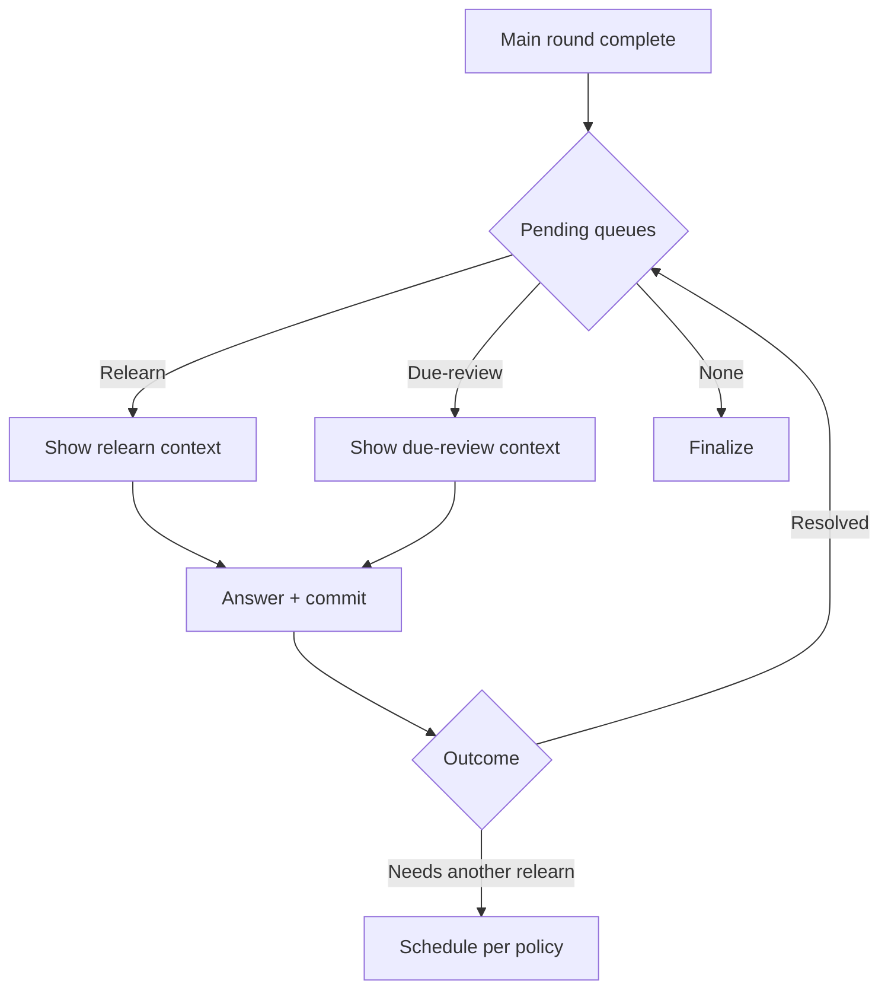

# Đặc tả UI/UX hoàn chỉnh — Relearn Cards

Flow này sở hữu queue phục hồi trong current session cho Cards có terminal outcome chưa đạt. SRS policy quyết định next due state.

## 1. Nguyên tắc đã chốt

- Relearn queue được tạo từ terminal outcomes đã commit, không từ transient wrong tap.
- Một Card xuất hiện tối đa một lần tại một queue position identity; retry không duplicate queue item.
- Relearn không xóa Attempts trước đó.
- User được biết còn bao nhiêu Cards cần relearn.
- Session không finalize khi required relearn queue còn item.
- Due-review phát sinh trong session là queue riêng, không trộn số liệu mơ hồ.
- Relearn không thay thế mastery retry round của Match, Guess, Recall hoặc Fill.

## 2. Entry conditions

| Condition | Queue |
| --- | --- |
| Terminal outcome requires relearn | Relearn |
| Card becomes due during long session | Due-review |
| Stage-level non-passing trong graded mode | Đưa vào mastery round kế của cùng mode; chưa enqueue Relearn |
| Hidden/deleted before queue turn | Skip với audit reason |

# 3. Master flow



# 4. Objective, archetype và composition

- Objective: xử lý Cards cần củng cố trước khi kết thúc session.
- Archetype: Focused task/study flow.
- Primary CTA theo current stage interaction.

```text
Relearn
<remaining count> cards to revisit

<prompt + interaction>

                                               [ Next ]
```

- Due review dùng label rõ `Due again`, không gọi là new Card.

# 5. Queue and outcome rules

- Mastery retry round phải hoàn tất trước khi stage/mode tạo terminal outcome. Relearn chỉ xét terminal outcomes đã commit sau ranh giới đó.
- Một Card có thể có nhiều attempt qua các mastery round nhưng chỉ được enqueue Relearn theo terminal policy, không theo từng transient `wrong`/`almost`. Recall UI Forgot đã được map thành canonical `wrong`.
- Queue order ổn định theo session policy và được checkpoint.
- Relearn answer dùng cùng idempotent Attempt contract.
- Policy có thể schedule lại trong session hoặc future due; UI không hard-code số vòng/thời gian.
- Card resolved khi terminal policy output không yêu cầu current-session revisit.
- Exit giữ remaining queue trong paused snapshot.

# 6. Lifecycle và errors

- Queue loading từ checkpoint; không recalculate tùy ý khi Resume.
- Save failure giữ answer/current queue position.
- Missing Card skip có reason, cập nhật remaining count, không substitute.
- Queue persistence failure: `Couldn’t save the relearn queue. Your answers are safe.` + Retry.
- Empty queue chuyển Finalize đúng một lần.

# 7. State matrix

- Relearn; due-review; one/many remaining; resolved; repeat scheduled.
- Saving/error/retry; resume mid-queue; missing Card.
- Long content/count, keyboard, large font, narrow device, light/dark.

# 8. Acceptance criteria

- Chỉ terminal committed outcome tạo queue item.
- Stage-level non-passing không được bỏ qua mastery round và không được chuyển thẳng thành Relearn item.
- Retry/resume không duplicate hoặc reorder queue.
- Required queue còn item thì không finalize.
- Exit/Resume giữ current position và remaining items.
- Relearn/due-review canonical session states parity dưới 3% mỗi theme.
