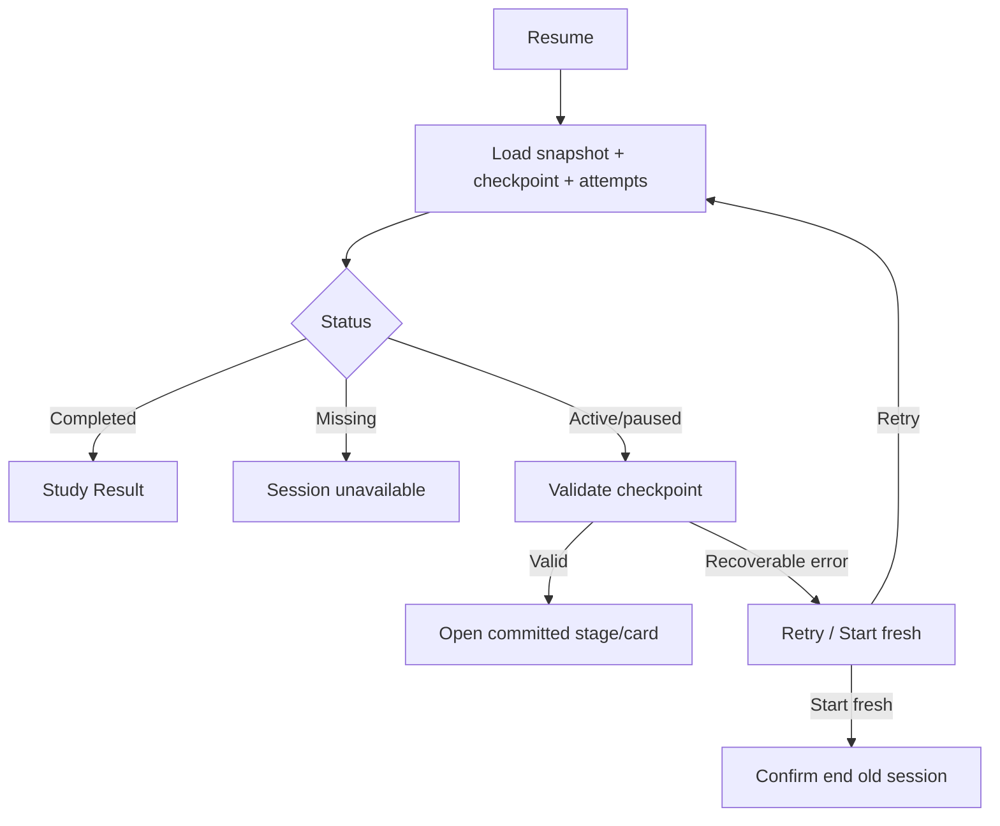

# Đặc tả UI/UX hoàn chỉnh — Resume Study Session

Flow này khôi phục active/paused session từ checkpoint đã commit gần nhất. Nó không replay UI state chưa persist hoặc tự suy đoán answer đang nhập dở.

## 1. Nguyên tắc đã chốt

- Resume dùng session snapshot + committed checkpoint.
- Attempt đã commit không được submit lại.
- Input/selection chưa commit có thể mất; UI phải nói rõ khi recovery cần thiết.
- Missing Card được xử lý theo snapshot policy; không thay bằng Card ngẫu nhiên.
- Resume failure cho Retry hoặc Start fresh sau impact confirmation.
- Start fresh không xóa progress đã commit từ session cũ.
- Resume không được tái tính mastery queue từ UI memory; round state phải đến từ committed checkpoint.

## 2. Entry points

| Context | Trigger | Session |
| --- | --- | --- |
| App launch/Dashboard | Continue | Active/paused session gần nhất |
| Start flow | Resume active session | Session tương thích |
| Study error | Retry resume | Current session id |
| Notification/deep link | Continue session | Revalidate session status |

# 3. Master flow



# 4. Objective, archetype và composition

- Objective: tiếp tục đúng vị trí đã lưu mà không duplicate answer.
- Archetype: Focused task/study flow.
- Resume error primary CTA `Try again`; secondary `Start fresh`.

```text
We couldn’t resume your session.
Your saved answers are still here.

[ Try again ]
  Start fresh
```

# 5. Checkpoint rules

- Checkpoint chỉ advance sau answer/stage completion commit.
- UI đang feedback nhưng commit chưa thành công → resume cùng question, chưa advance.
- Commit thành công nhưng UI chưa chuyển → resume next checkpoint.
- Với graded mode, checkpoint bắt buộc giữ `mode`, `roundIndex`, `shuffleVersion`, generated `currentRoundCardIds` order, current position và `nextRoundFailedCardIds`.
- Nếu attempt cuối round đã commit và failed set không rỗng, Resume mở round kế trong cùng mode; không chuyển mode.
- Nếu attempt cuối round đã commit và failed set rỗng, Resume mở mode kế đúng một lần.
- Mastery round, Relearn queue và due-review queue nằm ở các namespace checkpoint riêng.
- Recall checkpoint trước reveal giữ timer version, `remainingMs` và resolution identity. Resume tiếp tục thời gian còn lại, không reset về 20 giây.
- Nếu timeout đã commit trước interruption, Resume mở auto-revealed timeout feedback; không chạy timer hoặc cho self-grade lại.
- Completed session luôn route Result, không mở last question.

# 6. Changed-data decision table

| Change | Resume behavior |
| --- | --- |
| Deck moved/renamed | Resume theo Deck id; update display metadata |
| Deck deleted | Cho finish snapshot nếu content snapshot đủ; return Library |
| Card edited | Dùng version/snapshot đã chốt cho current session |
| Card deleted | Skip có audit reason hoặc block theo snapshot policy; không substitute |
| Preferences changed | Session giữ effective preferences snapshot |

# 7. Lifecycle

- Loading: session skeleton/progress; không render question giả.
- Success: announce resumed stage/progress; continue.
- Failure: giữ session active/paused; không mutate checkpoint.
- Start fresh confirm: nêu committed progress giữ lại, unfinished queue bị đóng.
- Session unavailable: về Dashboard/Deck với copy phục hồi.

# 8. Back, offline và concurrency

- Back từ resume error về Dashboard, giữ session paused.
- Resume local hoạt động offline.
- Hai thiết bị/process resume cùng session: conflict policy chỉ cho một effective writer; stale submit bị chặn.
- Retry idempotent và không advance checkpoint.

# 9. State matrix

- Loading; active; paused; completed; missing.
- Resume Stage 1–5; giữa mastery round; đầu retry round; relearn; due-review.
- Recoverable error; start-fresh confirm; stale writer conflict.
- Long content, large font, narrow device, light/dark.

# 10. Acceptance criteria

- Resume mở đúng committed checkpoint.
- Không duplicate committed Attempt.
- Failure không mất snapshot/checkpoint.
- Resume giữ nguyên failed set và không đưa Card đã đạt trở lại retry round.
- Resume không chuyển mode khi checkpoint còn Card không đạt.
- Resume dùng generated order đã commit; không tạo seed mới hoặc shuffle lại vì app restart/re-render.
- Resume Recall không duplicate timeout Attempt và không mất Card khỏi next-round failed set.
- Start fresh giữ progress đã commit và đóng old session rõ ràng.
- Completed session đi Result; deleted/moved Deck không tạo navigation loop.
- Canonical resume-error/session states parity dưới 3% mỗi theme.
