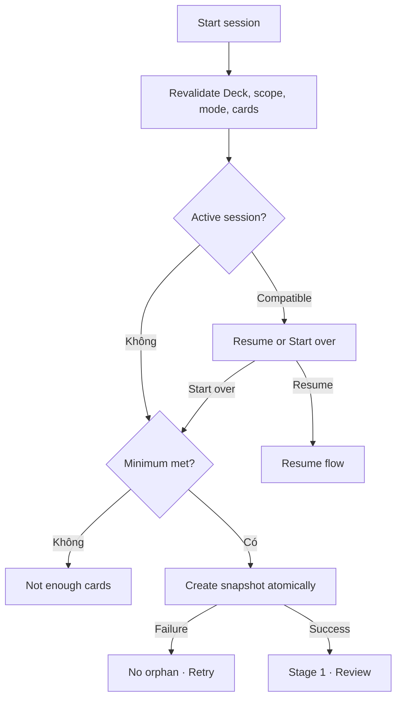

# Đặc tả UI/UX hoàn chỉnh — Start Study Session

Flow này sở hữu validation cuối và tạo session snapshot sau `deck/study-deck.md`. Nó không sở hữu Deck eligibility UI hoặc SRS algorithm.

## 1. Nguyên tắc đã chốt

- Start chỉ thành công khi scope, mode và eligible Card set vẫn hợp lệ.
- Snapshot cố định Deck id, base Card ids, mode, scope, effective preferences, start time, `shuffleVersion` và session shuffle seed material.
- Hidden/deleted/ineligible Card bị loại trước snapshot; count thay đổi phải được user biết.
- Không tạo hai active sessions từ double-submit/retry.
- Nếu có active session tương thích, user chọn Resume hoặc Start over; không ghi đè im lặng.
- Start failure không để orphan session.

## 2. Entry contract

| Input | Required | Source |
| --- | ---: | --- |
| Deck id | Có | Deck Study entry |
| Scope | Có | Current Deck/subtree selection |
| Mode | Có | Mode Picker |
| Eligible Card ids | Recomputed | Learning Progress + Card eligibility |
| Preferences | Effective snapshot | Preferences |

# 3. Master flow



# 4. Objective, archetype và composition

- Objective: bắt đầu đúng một session với scope/mode đã xác nhận.
- Archetype: Selection handoff.
- Primary CTA: `Start session`.

```text
Study <Deck name>
<scope label> · <eligible count> cards
<selected mode>

                                       [ Start session ]
```

Active session prompt: `Continue your session?` với `Resume` primary và `Start over` secondary/destructive-to-draft.

# 5. Validation decision table

| Condition | Result |
| --- | --- |
| Deck missing | Về Library; không create |
| Scope now empty | `No cards are available in this scope.` |
| Mode minimum not met | Giữ picker; chọn scope/mode khác |
| Guess không có ít nhất 5 meaning khác nhau | Chặn Start; yêu cầu thêm Card hoặc chọn scope khác |
| Some cards became ineligible | Refresh count; tiếp tục nếu minimum vẫn đạt |
| Compatible active session | Resume/Start over choice |
| Different active session | Nêu Deck/scope và cho Resume/End before new start |

# 6. Submit lifecycle

- Idle: mode/scope editable tại owning picker.
- Starting: label `Starting…`; disable Back, scope, mode và double-submit.
- Failure: `Couldn’t start the session. Your mode and scope are still selected.` + Retry.
- Success: replace picker bằng session route; không giữ duplicate picker/session.
- Retry dùng cùng start request identity và không tạo duplicate session.

# 7. Snapshot contract

- Session id và start-request id ổn định.
- Mỗi mode/round tạo deterministic Card permutation từ session id, mode id, round index và `shuffleVersion`; order đã checkpoint không silently đổi khi Deck thay đổi hoặc khi Resume.
- Card content dùng stable version/snapshot policy để answer current prompt nhất quán.
- Snapshot giữ stable Guess distractor candidate pool có ít nhất năm meaning khác nhau; mọi retry round tiếp tục dùng pool này dù `currentRoundCardIds` còn ít hơn năm.
- Stage order mặc định: Review → Match → Guess → Recall → Fill.
- Checkpoint ban đầu trỏ Stage 1 Review và Card đầu tiên trong shuffled Review order.
- Khi bắt đầu mỗi graded mode, `roundIndex = 1`, `currentRoundCardIds` nhận toàn bộ Card hợp lệ trong session snapshot và `nextRoundFailedCardIds` rỗng.
- Review không khởi tạo mastery retry round; nó dùng browse position riêng.
- Khi chuyển mode hoặc tạo retry round, persist generated order trước khi render Card đầu tiên. Với từ hai Card trở lên, không chấp nhận sequence giống hệt mode/round trước có cùng membership.

# 8. Cancel, offline và concurrency

- Cancel trước submit không tạo session.
- Local Study hoạt động offline.
- Card/Deck change trong start transaction buộc revalidation/rollback.
- App background trong Starting: khi quay lại, resolve request thành success hoặc safe retry; không create lần hai.

# 9. State matrix

- Valid Leaf/Parent/deep scope; no cards; not enough; count changed.
- Compatible/different active session; starting; failure; success.
- Long Deck/path/mode copy, large count/font, narrow device, light/dark.

# 10. Acceptance criteria

- Snapshot chỉ chứa eligible Cards và đáp ứng mode minimum.
- Double-submit/retry tạo tối đa một session.
- Active session không bị overwrite im lặng.
- Start failure không orphan record; selection được giữ.
- Snapshot đủ dữ liệu để Resume không phụ thuộc UI memory.
- Mọi Guess question dựng được đúng năm option từ snapshot; không có fallback option count.
- Mỗi graded mode có thể tạo số mastery round không giới hạn mà không thay đổi Card scope ngoài tập Card không đạt.
- Cùng snapshot/checkpoint luôn tái tạo cùng shuffled order; session mới tạo seed material mới.
- Mode Picker canonical states đạt parity dưới 3% mỗi theme.
