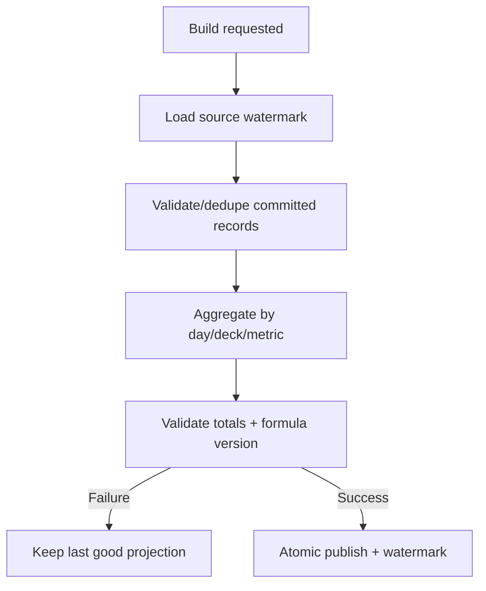

# Đặc tả nghiệp vụ hoàn chỉnh — Build Study Statistics

Flow này tổng hợp committed Sessions, Attempts, Progress history và Streak thành projection metric đã phiên bản hóa.

## 1. Nguyên tắc đã chốt

- Chỉ committed, non-duplicate source records được tính.
- Metric formula, timezone và rounding có version.
- Parent Deck aggregate mỗi descendant Card đúng một lần.
- Projection build không mutate source.
- Apply atomic và retry idempotent.

## 2. Master flow

## 3. Metric contract

- Session count/time, cards/attempts, accuracy/retention khi đủ dữ liệu.
- Daily activity/heatmap, current/longest streak và Deck scope summaries.
- Unknown/insufficient metric trả availability state, không trả số 0 gây hiểu nhầm.

## 4. Lifecycle

- Incremental build dùng watermark; full rebuild cùng formula cho cùng result.
- Late source record cập nhật đúng affected buckets.
- Failure giữ last-good projection và stale/error metadata.

## 5. State matrix

- Empty/minimum/dense history; Leaf/Parent/global scope.
- Duplicate/late/reset-boundary records, build/rebuild failure.
- Timezone/formula migration và large dataset.

## 6. Acceptance criteria

- Source record không double-count.
- Aggregate hierarchy/time deterministic.
- Failure không phát partial metrics.
- Projection đủ metadata để UI phân biệt zero, insufficient và stale.
