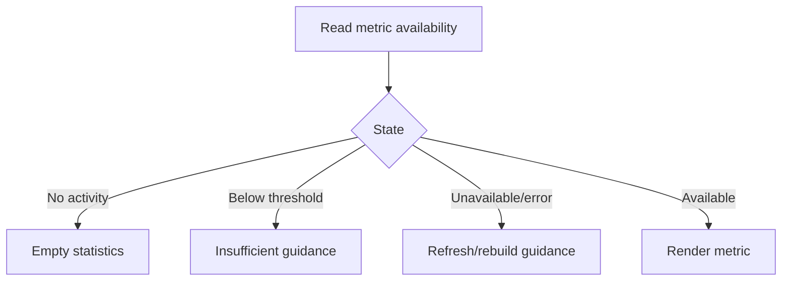

# Đặc tả UI/UX hoàn chỉnh — Handle Insufficient Statistics

Flow này phân biệt empty, insufficient sample và metric unavailable để hướng người học tới hành động phù hợp.

## 1. Nguyên tắc đã chốt

- Threshold thuộc formula version, không hard-code trong UI.
- `0` hợp lệ khác không có dữ liệu.
- Mỗi metric có thể đủ/thiếu độc lập.
- Copy không đưa ra kết luận retention/accuracy khi sample chưa đủ.
- Recovery CTA handoff Study flow, không tự tạo Session.

## 2. Master flow

## 3. Presentation contract

- Empty: giải thích chưa có completed study và CTA Start study.
- Insufficient: hiển thị progress-to-threshold khi policy cho phép.
- Unavailable: không giả zero; nêu Try again.
- Mixed screen giữ các metric đã đủ.

## 4. Lifecycle

- CTA revalidate due/scope qua Today/Study Session.
- Threshold change có formula label và rebuild, không tự reinterpret UI.
- Refresh success thay section tại chỗ, giữ scope/range.

## 5. State matrix

- Entire screen empty, one metric insufficient, true-zero metric.
- Offline/stale/rebuild-required, threshold boundary.
- Long guidance, large font, narrow, light/dark.

## 6. Acceptance criteria

- Zero/empty/insufficient/error không bị trộn.
- UI không tự tính threshold.
- Recovery giữ scope và handoff đúng owning flow.
- Available metrics vẫn đọc được khi metric khác thiếu.
