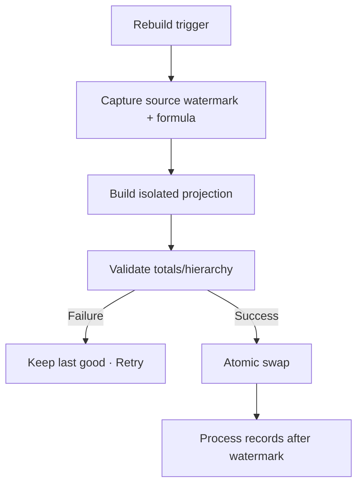

# Đặc tả nghiệp vụ hoàn chỉnh — Rebuild Statistics Projection

Flow này tái tạo projection sau reset, sync, restore, hierarchy change hoặc formula migration.

## 1. Nguyên tắc đã chốt

- Source committed records là nguồn duy nhất; projection có thể xóa/tạo lại.
- Reset Progress không đồng nghĩa xóa historical Attempts/Sessions.
- Rebuild chạy theo target formula version và source watermark cố định.
- Atomic publish; readers không thấy partial buckets.
- Retry/concurrent trigger idempotent và coalesce được.

## 2. Master flow

## 3. Trigger contract

- Restore/sync, Deck move/delete, reset boundary, source repair hoặc formula upgrade.
- Trigger có reason/correlation id; phạm vi partial chỉ dùng khi đủ an toàn.
- UI chỉ nhận building/stale/error/ready metadata.

## 4. Lifecycle

- Last-good projection vẫn đọc được với stale marker.
- Cancel app không để half projection; job resume/restart an toàn.
- Success invalidates Statistics/Dashboard caches theo version.

## 5. State matrix

- Full/affected-scope rebuild, no-op, large data.
- Source changes during build, invalid hierarchy, storage failure.
- Retry, concurrent sync/restore và formula migration.

## 6. Acceptance criteria

- Rebuild deterministic và atomic.
- Historical metrics không biến mất do Progress reset ngoài policy.
- Failure giữ last-good projection.
- Records sau watermark cuối cùng được phản ánh đúng một lần.
