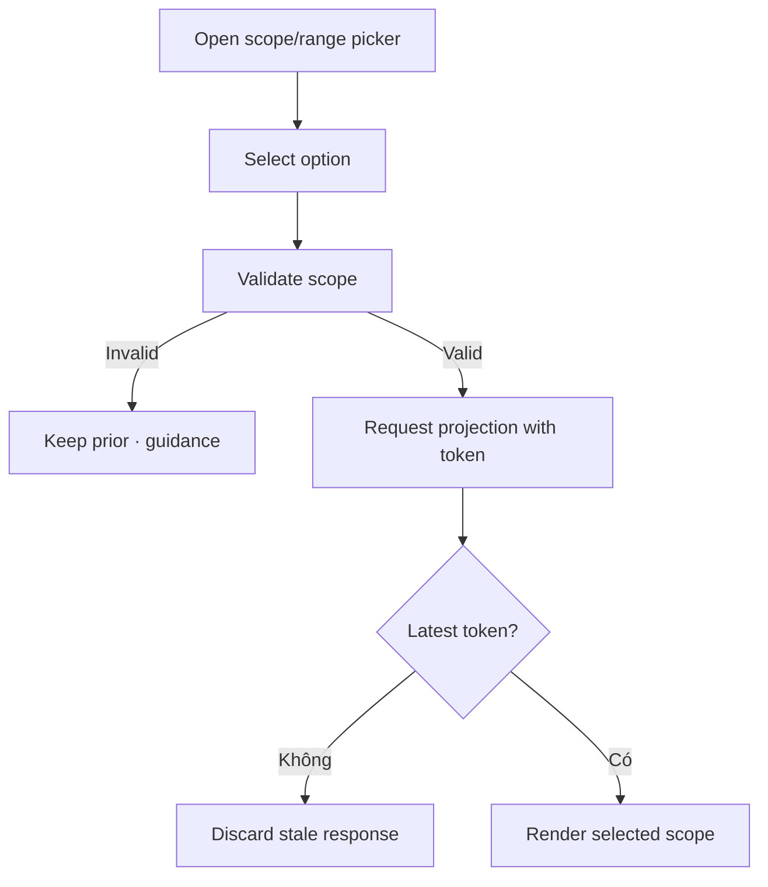

# Đặc tả UI/UX hoàn chỉnh — Switch Statistics Scope

Flow này đổi giữa global, Deck và time range, đồng thời chặn response cũ ghi đè lựa chọn mới.

## 1. Nguyên tắc đã chốt

- Scope phải tham chiếu Deck hiện tồn tại hoặc global.
- Parent Deck bao gồm descendants theo hierarchy snapshot của projection.
- Selection mới có request identity tăng dần; stale response bị bỏ.
- Đổi scope không mutate source/projection.
- Lựa chọn được giữ khi quay lại nếu vẫn hợp lệ.

## 2. Master flow

## 3. Objective và composition

- Objective: so sánh đúng phạm vi mà không mất context.
- Archetype: Filter/scope selection.
- Picker hiển thị Deck path để phân biệt tên trùng.
- Selected option có checkmark và accessible state.

## 4. Lifecycle

- Loading giữ selected label và prior content với loading indicator.
- Failure giữ prior valid view, nêu scope failed và Retry.
- Deleted/moved Deck revalidate; deleted fallback global có thông báo.

## 5. State matrix

- Global/Leaf/Parent/deep path; common time ranges/custom nếu supported.
- Rapid switch, stale response, deleted scope, failure/retry.
- Long paths, large font, narrow, light/dark.

## 6. Acceptance criteria

- Response cũ không ghi đè scope mới.
- Deck trùng tên phân biệt bằng path.
- Failure không blank last good statistics.
- Scope selection không thay đổi source data.
