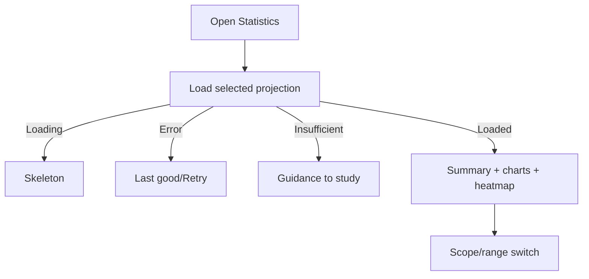

# Đặc tả UI/UX hoàn chỉnh — View Study Statistics

Flow này hiển thị summary, retention, activity heatmap và trends từ Statistics projection.

## 1. Nguyên tắc đã chốt

- Screen chỉ đọc projection; không tính lại metric trong UI.
- Mỗi metric có label, unit, time scope và availability rõ.
- Insufficient khác true zero; stale khác loading.
- Chart có text/table alternative và không dựa duy nhất vào color.
- Số, ngày và duration được localize nhất quán.

## 2. Master flow

## 3. Objective và composition

- Objective: hiểu xu hướng học trong scope hiện tại.
- Archetype: Analytical dashboard.
- Một top-level heading; scope/range controls; summary trước detail.
- CTA chỉ xuất hiện trong empty/insufficient recovery.

## 4. Presentation rules

- Không animate từ 0 theo cách gây hiểu nhầm khi refresh.
- Heatmap cell có accessible date/value label.
- Large count không truncate magnitude; chart labels có fallback.
- Stale indicator giữ data đọc được và cho Refresh.

## 5. State matrix

- Loaded global/Leaf/Parent/ranges; loading/error/stale.
- Empty, insufficient, zero-valid, dense/large values.
- Large font, screen reader, narrow, light/dark.

## 6. Acceptance criteria

- UI không biến unavailable thành 0.
- Scope/range luôn được hiển thị cùng metrics.
- Chart có representation truy cập được.
- Retry/refresh không làm mất last good data.
