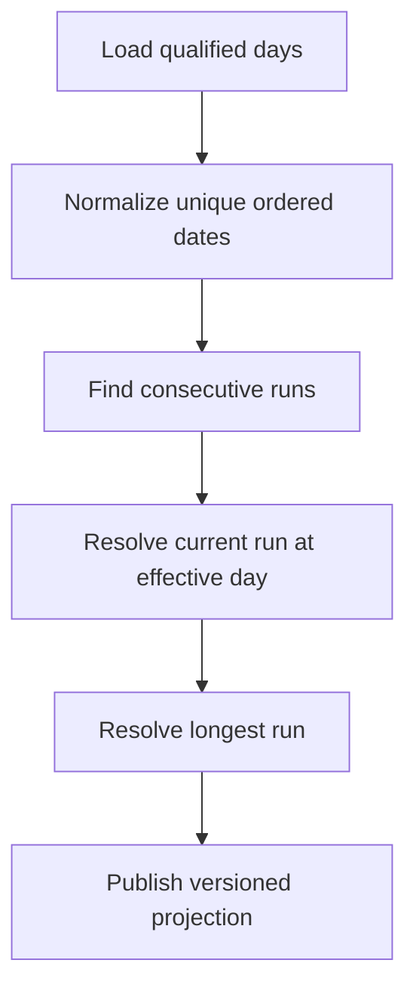

# Đặc tả nghiệp vụ hoàn chỉnh — Calculate Current Streak

Flow này tính current streak và longest streak từ qualified-day records tại một effective local day.

## 1. Nguyên tắc đã chốt

- Chỉ distinct qualified local days được tính.
- Current streak kết thúc tại hôm nay hoặc ngày gần nhất theo grace policy đã chốt.
- Longest streak không giảm khi current streak break.
- Cùng records + effective day + formula version cho cùng kết quả.
- Projection read không mutate day records.

## 2. Master flow

## 3. Output contract

| Field | Meaning |
| --- | --- |
| Current | Số ngày liên tiếp hiện hành |
| Longest | Run dài nhất trong history |
| Last qualified day | Mốc giải thích current state |
| Formula version | Khả năng audit/rebuild |

## 4. Boundary rules

- Empty history trả 0/0.
- Same-day repeats đã dedupe trước calculation.
- Gap trên một calendar day đóng current run.
- Future invalid records bị loại và báo reconciliation issue.

## 5. State matrix

- Zero, first day, active multi-day, broken, historical longest.
- Duplicate/unsorted/future records; timezone/DST boundary.

## 6. Acceptance criteria

- Không double-count hoặc dùng elapsed 24h thay calendar day.
- Current/longest deterministic.
- Broken current không xóa longest.
- Output đủ cho Dashboard/Statistics mà không lộ mutable source.
