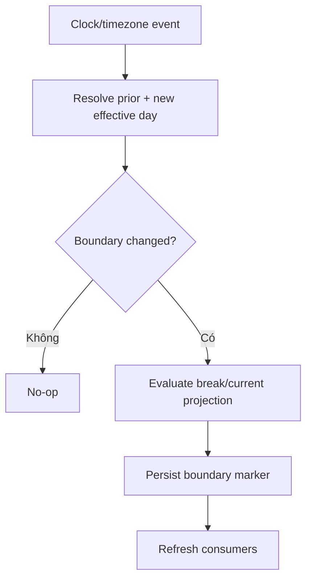

# Đặc tả nghiệp vụ hoàn chỉnh — Handle Streak Boundary

Flow này xác định effective local day qua midnight, timezone, DST và thay đổi clock để Streak không tạo/mất ngày giả.

## 1. Nguyên tắc đã chốt

- Calendar/timezone library là nguồn tính boundary; không dùng fixed 24 giờ.
- Event giữ timezone context tại thời điểm phát sinh.
- DST forward/back không nhân đôi local date.
- Clock rollback không tự xóa committed day.
- Thay đổi timezone kích hoạt re-evaluation có audit, không rewrite âm thầm.

## 2. Master flow

## 3. Boundary decision table

| Case | Result |
| --- | --- |
| Normal midnight | Advance một local date |
| DST change | Calendar date semantics |
| Timezone travel | Re-evaluate; giữ event context |
| Manual clock rollback | Không duplicate/uncommit day |

## 4. Failure và recovery

- Unknown timezone fallback rõ và gắn reconciliation required.
- Repeated event idempotent theo boundary identity.
- Projection refresh failure retry được từ boundary marker.

## 5. State matrix

- Midnight foreground/background, DST forward/back.
- East/west timezone travel, manual clock, offline resume.
- Duplicate/stale boundary event và recovery.

## 6. Acceptance criteria

- Một calendar date không bị tính hai lần.
- Boundary không phụ thuộc elapsed 24h.
- Timezone change audit/rebuild được.
- Consumer nhận projection mới mà không mutate source history.
